# Design Tokens Phase 2 — Implementation Plan

> 설계서: `dev/impl-notes/refactoring-design.md`
> 브랜치: `refactoring/design-tokens-phase2`
> 작성일: 2026-03-21

---

## 현재 상태 요약

Phase 1에서 토큰 인프라(Style Dictionary v5, W3C DTCG, 모듈 CSS 분리)를 구축했다.
Phase 2의 목표는 **제품 전체가 이 인프라 위에서 동작하게 만드는 것**이다.

핵심 발견:
- `tokens/semantic/color-light.json`에 graph, callout, git, status 토큰이 **이미 정의되어 있다**.
- Style Dictionary가 이들을 CSS 변수로 **이미 생성하고 있다**.
- 문제: CSS/컴포넌트가 생성된 변수를 **소비하지 않고** 직접 하드코딩하고 있다.
- 문제: `ThemeColors` (16키)가 이 확장 토큰을 **포함하지 않아** 커스텀 테마가 제어 불가.

---

## Phase 2-1: Contract 확장 (순차 실행)

### Task 1.1: 미정의 변수 19개 토큰 정의 추가

**목적**: audit에서 발견된 미정의 변수 중 Journal 전용 11개를 제외한 19개를 토큰 원본에 정의한다.

**대상 파일**:
- `tokens/semantic/color-light.json` — 토큰 추가
- `tokens/semantic/color-dark.json` — 토큰 추가

**추가할 토큰 매핑**:

| 미정의 변수 | 매핑할 semantic 토큰 | 비고 |
|---|---|---|
| `--color-bg-input` | `color.bg.input` → `{color.white}` / dark: `{color.slate.800}` | 입력 필드 배경 신규 |
| `--color-bg-selection` | `color.bg.selection` → `{color.blue.100}` / dark: `{color.blue.900}` | 선택 영역 배경 신규 |
| `--color-primary` | **제거** — `--color-accent-default` 로 통일 | legacy alias |
| `--color-success` | **이미 존재**: `color.status.success` → `--color-status-success` | CSS 참조명 불일치 |
| `--color-warning` | **이미 존재**: `color.status.warning` → `--color-status-warning` | CSS 참조명 불일치 |
| `--color-accent-light` | `color.accent.subtle` → `--color-accent-subtle` **이미 존재** | CSS 참조명 불일치 |
| `--color-hover` | **제거** — `--color-bg-hover` (= `--color-bg-subtle`) 로 통일 | legacy |
| `--color-error-bg` | `color.status.errorBg` → `{color.red.50}` / dark: `{color.red.950}` | 신규 |
| `--color-error-border` | `color.status.errorBorder` → `{color.red.200}` / dark: `{color.red.800}` | 신규 |
| `--border-primary` | **제거** — `--color-border-default` 로 통일 | legacy |
| `--bg-hover` | **제거** — `--color-bg-hover` 로 통일 | legacy |
| `--accent-warning` | **제거** — `--color-status-warning` 로 통일 | legacy |
| `--accent-ai` | `color.accent.ai` → `{color.violet.500}` / dark: `{color.violet.400}` | AI 전용 accent 신규 |
| `--red`, `--yellow`, `--blue`, `--green` | **제거** — `--color-status-*` 로 통일 | skills.css 단축명 |
| `--cal-accent` | **제거** — `--color-accent-default` 로 통일 | calendar 단축명 |
| `--graph-tag-color` | `color.graph.tag` → `{color.emerald.500}` / dark: `{color.emerald.400}` | 신규 |

**실제 신규 토큰**: 5개 (`bg.input`, `bg.selection`, `status.errorBg`, `status.errorBorder`, `accent.ai`, `graph.tag`)
**참조명 불일치 수정**: 3개 (`--color-success` → `--color-status-success` 등)
**레거시 제거**: 11개 (CSS에서 표준명으로 교체 후 삭제)

**수행 후**:
```bash
npm run tokens:build   # Style Dictionary 재생성
npm run audit:css-vars # 미정의 변수 감소 확인
```

**완료 기준**: `audit-css-vars.ts` 미정의 변수가 Journal 11개만 남는다.

---

### Task 1.2: ThemeColors contract 확장

**목적**: 커스텀 테마가 제어할 수 있는 변수를 16개에서 확장한다.

**대상 파일**:
- `src/types/theme.ts` — `ThemeColors` 인터페이스 확장
- `src/stores/settings/store.ts` — 마이그레이션 버전 v10 → v11
- 빌트인 테마 정의 파일 (8개 테마)

**확장할 키** (기존 16 + 신규):

| 카테고리 | 추가할 키 | 설명 |
|---|---|---|
| Background | `--color-bg-input` | 입력 필드 배경 |
| Status | `--color-status-danger`, `--color-status-warning`, `--color-status-success` | 상태 색상 |
| Accent | `--color-accent-subtle` | 연한 accent 배경 |
| Graph | `--color-graph-node`, `--color-graph-active`, `--color-graph-edge`, `--color-graph-label` | 그래프 핵심 4색 |

**총 키 수**: 16 → 25 (9개 추가)

> Graph 7개 전부가 아니라 핵심 4개만 테마 키로 노출. `activeBorder`, `neighbor`, `orphan`은 핵심 키에서 파생 가능.

**마이그레이션 전략**:
- v10 → v11: 기존 커스텀 테마에 누락된 키는 현재 빌트인 테마의 기본값으로 채운다.
- `onRehydrateStorage`에서 누락 키 감지 → 기본값 병합.

**완료 기준**: 8개 빌트인 테마 + 커스텀 테마가 25개 키를 모두 만족. 테마 전환 시 Graph/Status 영역도 변경됨.

---

## Phase 2-2: 소비 계층 마이그레이션 (병렬 실행 가능)

### Task 2.1: Legacy alias 제거

**목적**: `base.css`의 12개 alias를 소비처에서 표준명으로 교체한 뒤 alias를 삭제한다.

**대상 파일**:
- `src/styles/base.css` — alias 정의 삭제 (12줄)
- alias를 참조하는 모든 CSS/TSX 파일

**alias → 표준명 매핑**:

| Legacy alias | 표준명 | 참조 수 |
|---|---|---|
| `--color-text` | `--color-text-primary` | 조사 필요 |
| `--color-bg` | `--color-bg-default` | 조사 필요 |
| `--color-text-tertiary` | `--color-text-muted` | 조사 필요 |
| `--color-bg-hover` | `--color-bg-subtle` | 조사 필요 |
| `--color-danger` | `--color-status-danger` | 조사 필요 |
| `--color-error` | `--color-status-danger` | 조사 필요 |
| `--text-primary` | `--color-text-primary` | 조사 필요 |
| `--text-secondary` | `--color-text-secondary` | 조사 필요 |
| `--border` | `--color-border-default` | 조사 필요 |
| `--bg-primary` | `--color-bg-default` | 조사 필요 |
| `--bg-secondary` | `--color-bg-subtle` | 조사 필요 |
| `--hover` | `--color-bg-subtle` | 조사 필요 |

**작업 순서**: 각 alias를 grep → 사용처에서 표준명으로 교체 → alias 삭제 → audit 확인.

**완료 기준**: `base.css`에 legacy alias가 0개. audit 통과.

---

### Task 2.2: CSS 하드코딩 → 토큰 전환 (파일별 병렬)

**목적**: CSS 파일의 하드코딩 컬러를 기존/신규 토큰 변수로 전환한다.

파일을 **우선순위 그룹**으로 나누어 병렬 처리한다:

#### Group A — Critical (반복 심함, 토큰이 이미 존재)

| 파일 | 하드코딩 | 핵심 작업 |
|---|---|---|
| `graph.css` | 17 | `--graph-*` 로컬 변수 → `--color-graph-*` 토큰으로 교체 |
| `journal-notes.css` | 41 | `#5b7bd7` 반복 40회 → `--color-accent-default` 또는 Journal CSS 변수로 통합 |
| `journal-extras.css` | 18 | 상태색 → `--color-status-*` 토큰으로 교체 |
| `journal-mood.css` | 12 | mood 색상 → CSS 변수 통합 |
| `journal-calendar.css` | 5 | `--cal-accent` → `--color-accent-default` |

#### Group B — High (큰 파일, 다양한 색상)

| 파일 | 하드코딩 | 핵심 작업 |
|---|---|---|
| `components.css` | 64 | 배경/텍스트/보더 → 기존 semantic 토큰 매핑 |
| `editor.css` | 71 | 에디터 전용 색상 + syntax HL 분리 (HL은 예외) |
| `ai.css` | 38 | AI diff 색상 → `--color-status-*` + `--color-accent-ai` |
| `links.css` | 25 | 링크/백링크 색상 → `--color-accent-*` |

#### Group C — Medium (작은 파일)

| 파일 | 하드코딩 | 핵심 작업 |
|---|---|---|
| `dialogs.css` | 21 | 모달 배경/오버레이 → 토큰 |
| `skills.css` | 20 | `--red`/`--yellow` 등 → `--color-status-*` |
| `settings.css` | 13 | 설정 패널 색상 → 토큰 |
| `file-tree.css` | 10 | 파일 트리 색상 → 토큰 |
| `toolbar.css` | 7 | 툴바 색상 → 토큰 |
| `git.css` | 2 | `--color-git-*` 토큰 활용 |
| `panels.css` | 2 | 패널 색상 → 토큰 |

#### Group D — Fallback 정리

모든 그룹 작업 완료 후, 170개 fallback 패턴 `var(--x, #hex)` → `var(--x)` 로 일괄 정리.
정규식: `var\((--[a-z-]+),\s*#[0-9a-fA-F]+\)` → `var($1)`

**완료 기준**: `src/styles/` (generated 제외)에서 hex 리터럴이 의도적 예외(syntax HL)만 남는다.

---

### Task 2.3: 컴포넌트 하드코딩 → 토큰 전환

**목적**: TSX/TS 파일의 하드코딩 중 의도적 예외가 아닌 것을 토큰으로 전환한다.

**의도적 예외 (건드리지 않음)**: 49곳
- `file-icon.tsx` (17) — 언어 아이콘 색상
- `AppearanceTab.tsx` (16) — 테마 프리뷰
- `MoodBar.tsx` (5) — mood 시맨틱 색상
- `MoodTrend30.tsx` (5) — mood 차트 색상
- `TagPanel.tsx` (6) — 태그 팔레트

**전환 대상**: ~122곳
- Plugin 컴포넌트 (PluginCard, PluginDetail, PluginCapabilityBadge, PluginMarketplace) — fallback → 변수 단독
- GraphView, graph-utils — 하드코딩 → `--color-graph-*` 토큰
- FindReplaceBar — 하이라이트 색상 → 토큰
- ExportDialog — export 테마 색상 → 토큰
- SkillDependencySection — 상태 색상 → 토큰

**완료 기준**: audit에서 컴포넌트 미정의 변수 0개.

---

## Phase 2-3: 방어 체계 (마무리)

### Task 3.1: audit-css-vars CI 게이트

**목적**: 미정의 CSS 변수가 PR에서 자동 차단되도록 한다.

**대상 파일**:
- `scripts/audit-css-vars.ts` — exit code 정리 (현재 exit 1이지만 CI 미연결)
- `.github/workflows/ci.yml` (또는 해당 CI 설정) — audit 단계 추가
- `package.json` — `"audit:css-vars"` 스크립트 확인

**구현**:
```yaml
# CI에 추가
- name: Audit CSS variables
  run: npm run audit:css-vars
```

**Journal 예외 처리**: audit 스크립트에 `--ignore` 옵션 추가, 또는 Journal 변수를 allowlist에 등록.

**완료 기준**: 미정의 변수가 있는 PR이 CI에서 실패한다.

---

### Task 3.2: 커스텀 테마 contract 검증

**목적**: 사용자가 만든 커스텀 테마가 필수 키를 빠뜨리지 않도록 한다.

**대상 파일**:
- `src/stores/settings/store.ts` — `saveCustomTheme` 함수에 검증 추가
- `src/components/settings/tabs/AppearanceTab.tsx` — ThemeEditor에 누락 키 경고 UI

**구현**: `ThemeColors` 키 목록 대비 누락 검사 → 누락 시 기본값 자동 채움 + 경고.

**완료 기준**: 불완전한 커스텀 테마가 저장 시 자동 보완된다.

---

### Task 3.3: 팀 운영 문서화

**목적**: 토큰 시스템의 원본/생성물/소비 경계를 문서로 남긴다.

**산출물**: `dev/design/design-tokens-guide.md`

**내용**:
1. 토큰 계층 구조 (primitive → semantic → generated → consumed)
2. 파일 매핑 (어디가 원본, 어디가 생성물, 어디가 소비)
3. 새 토큰 추가 절차 (JSON → build → CSS → 컴포넌트)
4. 커스텀 테마 만들기 가이드
5. 의도적 예외 목록과 사유
6. FAQ (자주 하는 실수, 올바른 패턴)

**완료 기준**: 새 팀원이 이 문서만으로 "어디를 수정해야 하는가"를 알 수 있다.

---

## 실행 순서 요약

```mermaid
gantt
    title Phase 2 실행 계획
    dateFormat X
    axisFormat %s

    section Phase 2-1 (순차)
    Task 1.1 미정의 토큰 추가       :t11, 0, 2
    Task 1.2 ThemeColors 확장       :t12, after t11, 2

    section Phase 2-2 (병렬)
    Task 2.1 Legacy alias 제거      :t21, after t12, 1
    Task 2.2A CSS Critical 그룹     :t22a, after t12, 3
    Task 2.2B CSS High 그룹         :t22b, after t12, 3
    Task 2.2C CSS Medium 그룹       :t22c, after t12, 2
    Task 2.2D Fallback 일괄 정리    :t22d, after t22a, 1
    Task 2.3 컴포넌트 전환          :t23, after t12, 2

    section Phase 2-3 (마무리)
    Task 3.1 CI 게이트              :t31, after t22d, 1
    Task 3.2 테마 검증              :t32, after t12, 1
    Task 3.3 문서화                 :t33, after t31, 1
```



## 검증 전략

각 Task 완료 후 다음을 실행:

```bash
npm run tokens:build          # 토큰 재생성
npm run audit:css-vars        # 미정의 변수 확인
npm test                      # 기존 테스트 통과
npm run build                 # 빌드 성공
```

Phase 2 전체 완료 후:
- audit 미정의 변수 = Journal 11개만 (allowlist)
- 테마 전환 시 Graph, Callout, Export, Editor, Status 영역이 모두 반응
- 8개 빌트인 테마 + 커스텀 테마가 25키 contract 충족
- base.css legacy alias = 0개

## 리스크

| 리스크 | 영향 | 완화 |
|--------|------|------|
| 하드코딩 → 토큰 전환 시 시각적 regression | 테마별 색상 미세 차이 | 전환 전/후 스크린샷 비교 |
| ThemeColors 확장 시 v10→v11 마이그레이션 실패 | 커스텀 테마 깨짐 | onRehydrate에서 기본값 자동 병합 |
| Journal CSS 변수가 JS 런타임 주입이라 audit 오탐 | CI 실패 | allowlist 등록 |
| 대량 CSS 변경으로 merge conflict | Phase 2-2 병렬 작업 충돌 | 파일 단위 분리, 작업자별 파일 할당 |
