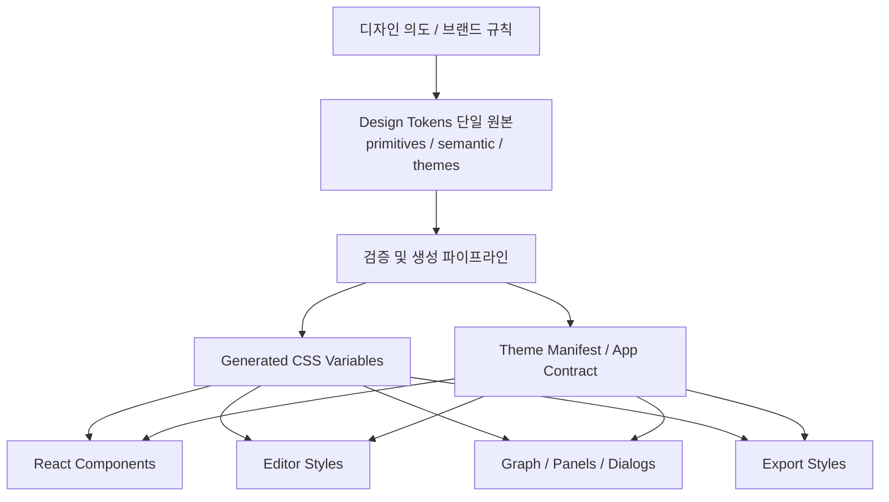
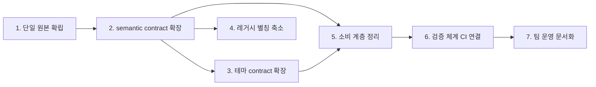

## 이 문서의 위치

Phase 1 (`refactoring/design-tokens` 브랜치, 2026-03-15 완료)에서 토큰 인프라를 구축했다:
- Style Dictionary v5 + W3C DTCG 토큰 시스템 도입
- App.css (14,506줄) → 19개 모듈 CSS 파일 분리
- 13개 CSS 변수 체계적 리네이밍
- 커스텀 테마 v10 마이그레이션

이 문서는 **Phase 2: 토큰 시스템 전면 적용**을 위한 설계서다.
Phase 1이 "토큰 인프라를 만든 것"이라면, Phase 2는 "제품 전체가 그 인프라 위에서 동작하게 만드는 것"이다.

---

## 배경

현재 Baram의 디자인 토큰 구조는 `generated CSS`, `base alias`, `runtime theme`, `컴포넌트별 하드코딩 색상`이 섞여 있다.
겉으로는 토큰 시스템처럼 보이지만, 실제로는 같은 의미의 색과 간격이 여러 층에서 서로 다른 이름과 방식으로 관리되고 있다.

이 상태에서는 작은 스타일 변경도 영향을 예측하기 어렵고, 테마를 추가하거나 수정할 때 일부 화면만 바뀌는 문제가 생긴다.
"어디를 고쳐야 하는지"보다 먼저 "무엇이 진짜 원본인지"부터 찾아야 하는 구조다.

우리는 예쁜 변수명을 늘리려는 게 아니다.
디자인 값을 **한 군데서 정의하고, 같은 의미는 항상 같은 이름으로 소비되게 만들기 위해** 이 일을 한다.

## 현 상황 진단

현재 상태를 구조적으로 보면 다음과 같다.

- 디자인 값의 원본이 한 곳에 모여 있지 않다.
- 같은 의미의 값이 `semantic token`, `legacy alias`, `fallback`, `컴포넌트 내부 literal`로 중복 표현된다.
- 일부 영역은 토큰 계약을 따르지만, 일부 영역은 각자 별도 규칙으로 색과 상태를 관리한다.
- 테마는 존재하지만, 실제 제품 전체를 완전히 제어하는 수준의 계약으로 묶여 있지 않다.
- 결과적으로 "토큰이 있는 구조"와 "토큰 기반으로 운영되는 구조" 사이에 큰 차이가 남아 있다.

이 말은 곧, 현재 구조가 전혀 정리되지 않았다는 뜻은 아니다.
하지만 현재의 토큰은 시스템의 중심이라기보다, 여러 레이어 중 하나로 존재하고 있다.
즉 지금은 토큰이 제품을 통제하는 것이 아니라, 제품의 일부만 설명하고 있는 상태에 가깝다.

### 정량 현황 (2026-03-21 기준)

| 지표 | 수치 | 설명 |
|------|------|------|
| 정의된 CSS 변수 | 219개 | `tokens/` + `generated/` + `base.css` 합산 |
| 참조되는 CSS 변수 | 112개 | 실제 소비되는 변수 |
| 테마 제어 변수 | 16개 | `ThemeColors` 인터페이스 (전체의 14%) |
| 미정의 변수 참조 | 30개 | `audit-css-vars.ts` 결과 |
| Legacy alias | 12개 | `base.css`에 정의된 과거 호환 별칭 |
| CSS 내 하드코딩 컬러 | ~196곳 | generated 제외, fallback 패턴 제외 |
| CSS 내 fallback 패턴 | 170곳 | `var(--x, #hex)` 형태 |
| 컴포넌트 내 하드코딩 | 171곳 | 16개 TSX/TS 파일 |
| Journal 독립 테마 | 6개 | 앱 테마와 완전 분리된 별도 시스템 |

### 미정의 변수 30개 분류

| 분류 | 변수 | 수량 |
|------|------|------|
| Journal/Mood 전용 | `--mood-deep`, `--mood-calm`, `--mood-neutral`, `--mood-warm`, `--mood-bright`, `--mood-accent-rgb`, `--journal-font-family`, `--journal-line-height`, `--journal-header-bg`, `--journal-prompt-bg`, `--journal-prompt-border` | 11 |
| 일반 UI 누락 | `--color-bg-input`, `--color-bg-selection`, `--color-primary`, `--color-success`, `--color-warning`, `--color-accent-light`, `--color-hover`, `--color-error-bg`, `--color-error-border` | 9 |
| 레거시 약칭 | `--border-primary`, `--bg-hover`, `--accent-warning`, `--accent-ai`, `--red`, `--yellow`, `--blue`, `--green` | 8 |
| 도메인 특화 | `--cal-accent`, `--graph-tag-color` | 2 |

## 냉정한 평가

지금 구조는 production-grade design token system이라고 부르기 어렵다.
CSS 변수가 많이 존재하고, 테마 개념도 있으며, 일부 semantic naming도 도입되어 있다.
하지만 그것만으로 시스템이 되는 것은 아니다.

냉정하게 말하면 현재 상태는 다음에 더 가깝다.

- "단일 원본을 가진 디자인 시스템"보다는 `생성된 변수 + 레거시 별칭 + 하드코딩 예외`의 혼합 구조
- "계약 기반의 테마 시스템"보다는 일부 화면에 강하게 적용되는 프리셋 집합
- "새 팀원이 빠르게 이해할 수 있는 구조"보다는 기존 맥락을 많이 아는 사람이 유리한 구조

이 상태를 그대로 두면 앞으로 디자인 변경은 계속 가능하겠지만,
변경이 쉬워지는 것이 아니라 **사람이 기억과 검색으로 버티는 방식**으로 유지될 가능성이 높다.
그건 시스템이 팀을 돕는 구조가 아니라, 팀이 시스템의 빈틈을 메우는 구조다.

## 왜 이 일이 필요한가

### 1. 변경 비용을 낮추기 위해

지금 구조에서는 버튼 하나의 강조색을 바꾸더라도 토큰, 별칭, CSS fallback, 컴포넌트 내부 하드코딩을 모두 의심해야 한다.
이건 전등 스위치 하나 바꾸려고 배전반 전체를 열어보는 꼴이다.

### 2. 테마 품질을 보장하기 위해

현재는 16개 토큰만 테마로 제어되고, 나머지는 화면 곳곳에서 따로 관리된다.
그 결과 "테마를 바꿨는데도 callout, graph, export, editor 일부가 제각각 보이는" 상태가 생긴다.

### 3. 협업 언어를 통일하기 위해

디자이너, 프론트엔드, QA가 같은 값을 다른 이름으로 부르면 유지보수 속도가 급격히 떨어진다.
토큰 체계는 단순한 CSS 정리가 아니라, 팀 전체가 같은 단어로 이야기하게 만드는 계약이다.

### 4. 제품을 오래 운영하기 위해

production에서는 기능 추가보다 "기존 화면이 얼마나 안전하게 바뀌는가"가 더 중요하다.
토큰 구조가 흔들리면 리디자인, 브랜딩 변경, 접근성 개선, 다크 모드 보정 같은 작업이 전부 비싸진다.

## 지금의 문제를 한 줄로 요약하면

디자인 의도는 하나인데, 값의 원본은 여러 군데에 흩어져 있다.
그래서 수정할수록 구조가 좋아지는 게 아니라, 우연히 맞아떨어지기를 기대하게 된다.

## 우리가 원하는 결과

이 작업이 끝나면 다음이 가능해야 한다.

- 디자인 값의 원본이 한 곳에 모여 있다.
- 모든 테마가 같은 semantic contract를 따른다.
- 컴포넌트는 토큰을 소비만 하고, 값 자체를 새로 만들지 않는다.
- 특정 색/간격/타이포를 바꿀 때 영향 범위를 예측할 수 있다.
- Editor, Graph, Callout, Export처럼 떨어져 보이던 화면도 같은 규칙 아래 움직인다.
- 새 팀원이 들어와도 "어디가 진짜 원본인지" 바로 이해할 수 있다.

## 목표 구조

## 기대 효과

### 제품 관점

- 테마 변경이 부분 적용이 아니라 전체 경험 단위로 동작한다.
- UI 일관성이 올라가고, 화면별 예외가 줄어든다.
- 향후 브랜딩 확장이나 프리셋 추가가 쉬워진다.

### 개발 관점

- "토큰을 정의하는 곳"과 "토큰을 소비하는 곳"이 분리된다.
- 새 기능을 만들 때 기존 규칙을 재사용하기 쉬워진다.
- 하드코딩 색상과 임시 fallback가 줄어들어 디버깅 비용이 감소한다.

### 팀 관점

- 디자이너, 프론트엔드, QA가 같은 semantic token 언어로 소통할 수 있다.
- 리뷰 기준이 명확해진다. "예쁘냐"보다 "정해진 계약을 따르느냐"를 볼 수 있다.

## 완료되었다고 말할 수 있는 상태

구현 방식이 아니라 결과 기준으로 보면 아래 상태를 목표로 한다.

- 모든 shipped theme가 동일한 semantic token 집합을 가진다.
- 주요 UI 영역이 공통 토큰 계약 위에서 동작한다.
- 정의되지 않은 토큰 참조가 없다.
- 새 하드코딩 디자인 값이 기본 경로로 들어오지 않는다.
- 테마 변경이 Editor, Graph, Callout, Export까지 일관되게 반영된다.
- 팀원이 디자인 변경 요청을 받았을 때, 수정 위치를 추측하지 않고 찾을 수 있다.

## 의도적 예외 (토큰화하지 않는 항목)

모든 색상을 토큰으로 만드는 것이 목표가 아니다. 다음은 **의도적으로 토큰 범위에서 제외**한다:

| 항목 | 파일 | 사유 |
|------|------|------|
| 파일 아이콘 색상 (13색) | `file-icon.tsx` | 언어별 구문 강조 — 브랜드/테마와 무관한 업계 관례 |
| 테마 에디터 스워치 프리뷰 | `AppearanceTab.tsx` | 테마 프리뷰 용도의 고정 대비색 |
| Syntax highlighting 토큰 | `editor.css` (CodeMirror) | 코드 하이라이팅은 별도 체계 (CodeMirror 테마) |
| Shadow 토큰 (4개) | `base.css` | `rgb(0 0 0 / N%)` — 라이트/다크 모두 동작, 테마 제어 불필요 |

이 외의 하드코딩은 **해결 대상**이다.

## Journal 테마 — Scope 결정

`journal-themes.ts`의 6개 Journal 테마(Classic Diary, Moleskine, Muji 등)는 앱 테마와 **독립된 별도 시스템**이다.
각 Journal 테마는 7개 색상 + 타이포그래피를 자체 정의한다.

**방침**: Phase 2에서는 Journal 테마 시스템 자체를 통합하지 않는다.
단, Journal 테마가 참조하는 미정의 CSS 변수 11개(`--mood-*`, `--journal-*`)는 **런타임에 JS로 주입되므로** 토큰 원본에 추가할 필요는 없다.
Journal 테마의 토큰 시스템 통합은 향후 별도 이슈로 다룬다.

## Fallback 패턴 방침

CSS에서 170곳이 `var(--color-x, #hex)` 형태의 fallback을 사용한다.

**방침**:
1. 참조하는 변수가 토큰 원본에 정의되어 있으면 → **fallback 제거** (불필요한 중복)
2. 참조하는 변수가 아직 정의되지 않았으면 → 먼저 토큰 정의 추가 → 그 후 fallback 제거
3. 최종 상태: `var(--color-x)` 단독 사용, fallback 없음. 미정의 변수는 audit가 잡는다.

## 하위 작업 목록

아래 항목은 의존 관계를 반영하여 Phase로 구분한다.

### Phase 2-1: Contract 확장 (선행 조건, 순차)

#### 1. 디자인 값의 단일 원본 확립

- 결과: 디자인 값의 공식 원본이 저장소 안에서 명확히 합의되어 있다.
- 결과: generated 산출물은 원본이 아니라 배포용 결과물로만 취급된다.
- 결과: 토큰 수정 요청이 들어왔을 때, 팀이 수정 위치를 추측하지 않는다.
- **작업 크기**: 소 — `base.css`의 12개 alias 중 토큰 원본으로 승격할 것 결정

#### 2. semantic token contract 확장

- 결과: 미정의 변수 30개 중 해결 대상(Journal 11개 제외 = 19개)이 토큰 원본에 정의된다.
- 결과: Editor, Graph, Callout, Panels, Export가 같은 계약을 공유한다.
- 결과: 같은 의미의 값을 여러 이름으로 부르는 일이 줄어든다.
- **작업 크기**: 중 — `tokens/semantic/color-light.json`, `color-dark.json` 확장 + Style Dictionary 재생성

#### 3. 테마 contract 확장

- 결과: `ThemeColors` 인터페이스가 16개 → 확장된 semantic 집합을 반영한다.
- 결과: shipped theme 8개가 모두 확장된 contract를 만족한다.
- 결과: 특정 테마만 예외적으로 빠지거나 덜 적용되는 영역이 없어진다.
- **작업 크기**: 중 — `src/types/theme.ts` + 8개 테마 정의 업데이트

### Phase 2-2: 소비 계층 마이그레이션 (병렬 가능)

#### 4. 레거시 별칭 축소

- 결과: `base.css`의 12개 alias 중 불필요한 것이 제거된다.
- 결과: 새 코드가 오래된 이름 체계에 기대지 않는다.
- 결과: 남아 있는 예외는 의도적으로 관리되는 목록으로 설명 가능하다.
- **작업 크기**: 소 — alias 사용처 검색 → 표준명으로 교체 → alias 제거

#### 5. 소비 계층 정리

- 결과: CSS 하드코딩 ~196곳이 토큰 참조로 전환된다.
- 결과: 컴포넌트 하드코딩 171곳 중 의도적 예외를 제외한 곳이 토큰으로 전환된다.
- 결과: fallback 패턴 170곳에서 불필요한 fallback이 제거된다.
- 결과: 화면별 개별 규칙이 줄고, 공통 계약을 따르는 방향으로 수렴한다.
- **작업 크기**: 대 — 가장 큰 작업. CSS 파일별 병렬 처리 가능

### Phase 2-3: 방어 체계 (마무리)

#### 6. 생성 및 검증 체계 CI 연결

- 결과: `audit-css-vars.ts`가 CI에서 실행되어 미정의 변수를 차단한다.
- 결과: 잘못된 참조, 누락된 토큰, 테마 간 불일치가 자동으로 드러난다.
- 결과: "바뀐 줄 알았는데 일부만 적용됨" 같은 문제가 늦게 발견되지 않는다.
- **작업 크기**: 소 — audit 스크립트 exit code 활용 + CI 설정

#### 7. 팀 운영 문서화

- 결과: 원본, 생성물, 소비 계층의 경계가 문서로 설명된다.
- 결과: 새로운 디자인 변경 요청이 들어왔을 때 따라야 할 기준이 명확하다.
- 결과: 개인의 암묵지보다 구조와 문서가 우선하는 상태가 된다.
- **작업 크기**: 소 — 구조 확정 후 문서 작성

## 체크리스트

### 결과 체크리스트

- [x] generated 산출물은 원본과 구분되는 결과물로 운영된다. *(Phase 1 완료)*
- [ ] 디자인 값의 공식 원본이 저장소 안에서 한 체계로 정리되어 있다.
- [ ] 모든 shipped theme가 동일한 semantic token contract를 만족한다. *(현재 16개만 — 부분 충족)*
- [ ] 주요 UI 영역이 공통 semantic token 계약 위에서 동작한다.
- [ ] 정의되지 않은 토큰 참조가 남아 있지 않다. *(현재 30개)*
- [ ] 새 하드코딩 디자인 값이 기본 경로로 들어오지 않는다.
- [ ] legacy alias와 fallback는 통제 가능한 예외 수준으로 축소된다. *(현재 12 alias + 170 fallback)*
- [ ] 테마 변경이 Editor, Graph, Callout, Export까지 일관되게 반영된다.
- [ ] 디자인 변경 요청 시 수정 위치를 추측하지 않고 찾을 수 있다.
- [ ] 팀이 동일한 semantic token 언어로 리뷰하고 소통할 수 있다.

### 운영 체크리스트

- [ ] 토큰 변경이 검증 가능한 생성 파이프라인을 통해 반영된다.
- [ ] 테마 간 누락, 불일치, 잘못된 참조를 조기에 확인할 수 있다. *(audit 스크립트 존재, CI 미연결)*
- [ ] 원본/생성물/소비 경계가 문서로 설명되어 있다.
- [ ] 새로 합류한 사람도 구조를 문서만으로 이해할 수 있다.

## 이 이슈가 다루지 않는 것

- 새로운 비주얼 스타일 자체를 만드는 일
- 테마 개수를 늘리는 일 자체
- 특정 컴포넌트 하나만 예쁘게 고치는 국소 개선
- Journal 테마 시스템의 앱 테마 통합 (별도 이슈)
- CodeMirror syntax highlighting 테마 통합

이 이슈의 목적은 "예쁘게 바꾸기"가 아니라,
**앞으로의 모든 디자인 변경이 더 싸고, 안전하고, 예측 가능하게 일어나도록 구조를 바로잡는 것**이다.
