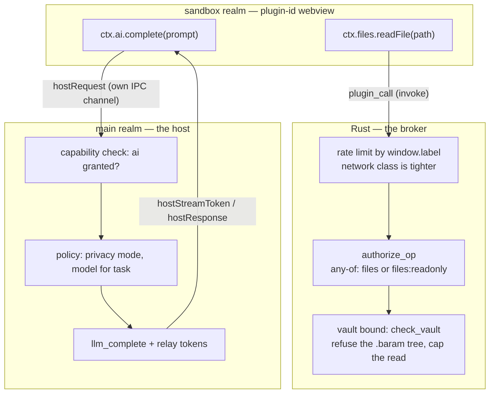

# Brokered `files` + Host-Mediated `ai` (§260 Phase 3c-2c) Implementation Plan

> **For agentic workers:** Steps use checkbox (`- [ ]`) syntax. Implement task-by-task, run the stated test after each step, commit per task.

**Goal:** finish the brokered-service surface a sandboxed plugin actually needs — `files` (vault-bounded, in Rust) and `ai` (host-mediated RPC) — and land the **per-op rate limit** on `plugin_call` that 3c-2a recorded as owed before Phase 4. After this phase every capability in `PluginCapability` that a sandbox can hold is either enforced at a real boundary or explicitly deferred to Phase 4 (`editor`, `commands`, `events`, `ui`, `settings`).

## Why the two services land on opposite sides of the boundary

They are not symmetric, and picking the wrong side loses a guarantee:

- **`files` belongs in Rust.** The vault boundary already lives there (`fs_cmd::check_vault` → `ContextManager::validate_path_any`, canonicalizing both sides so a symlink cannot escape). Re-implementing it in the host realm would fork the rule that every other file IPC obeys; routing through the host would also add a hop with no added check. The sandbox names a path, Rust decides.
- **`ai` cannot go in Rust.** The *policy* — privacy mode (`useAIStore`), per-task model/provider/baseUrl selection (`getConfigForTask`), and `isLLMAllowed` — is frontend state. A Rust `ai` op would have to accept `model`/`provider`/`baseUrl` **from the sandbox**, which hands a plugin the ability to pick its own endpoint and step around privacy mode. Host-mediated keeps the policy where it already is and means the op carries **no** model, provider, or URL at all: prompt in, tokens out.

Both directions keep the property the ACL gives us: a `plugin-*` window can invoke `plugin_call` (+ the two transport commands) and nothing else, so it can reach neither `read_file` nor `llm_complete` directly.

**Tech Stack:** Rust (Tauri v2 commands, managed state, token bucket over `Instant`), TypeScript (request/response correlation over the 3c-2a transport), Vitest + `cargo test`.

## Global Constraints

- **Scope.** In: `PluginOp::Files{Read,Write,List}` + any-of capability requirement + vault bounding + `.baram` denial + a read/write size cap; sandbox-side `ctx.files`; `hostRequest`/`hostResponse`/`hostStreamToken` protocol frames + session routing; a host-side `ai` bridge reusing the trusted tier's AI policy; per-op rate limiting on `plugin_call`. **Out (Phase 4):** `editor`, `commands` (beyond today's invoke), `events` beyond emit/deliver, `ui`, `settings`, document transforms. **Out (3c-3):** the LIVE user-run smoke.
- **No new Tauri command, so no ACL churn.** `files` rides `plugin_call`; `ai` rides the existing 3c-2a transport. `build.rs`/`AppManifest`/both capability files are untouched — a deliberate property, since every past §260 phase that added a command paid the all-or-nothing AppManifest tax.
- **Plugins stay OFF** (`VITE_ENABLE_PLUGINS`) and sandbox-webview creation stays dev-gated (`isSandboxRuntimeAllowed`). Phase 5 lifts both.
- **One vault rule, not two.** Sandbox file ops must call the same `check_vault` path as `read_file`/`write_file`, reached through a new `pub(crate)` helper in `fs_cmd.rs` — not a copy. Deny-by-default when no context/vault is open is inherited for free.
- **Capability strings stay manifest-derived.** The authorizer keeps comparing plain strings from the manifest; `files:readonly` is not a subset relation encoded anywhere but the op's own any-of list.
- **TS conventions:** `import type` (`verbatimModuleSyntax`), files ≤ ~300 lines, `useShallow` for any Zustand selector, `createLLMStream` cleanup in `finally`.
- **`src/plugins/types.ts` edits require `npm run types:plugin`** + committing `examples/plugins/*.d.ts` (recurring §260 CI trap).

---

### Task 1: Rust — an any-of capability requirement

**Files:** Modify `src-tauri/src/plugin/authorizer.rs`; tests alongside.

**Why:** `required_capability() -> Option<&'static str>` cannot express "`files` **or** `files:readonly`". Encoding that at the call site would put an authorization decision outside the authorizer — the mistake 3c-2b's `authorize_op` was introduced to prevent.

**Interfaces:**

- Produces: `CapabilityRequirement { None, AnyOf(&'static [&'static str]) }`, `PluginOp::capability_requirement()`, `PluginAuthorizer::authorize_any(label, &[&str])`.
- `authorize(label, cap)` stays as the single-capability form (existing call sites + tests) delegating to `authorize_any`.

- [ ] **Step 1: Write the failing tests.** A grant of `files:readonly` admits a read but not a write; a grant of `files` admits both; neither admits `storage`; the denial message names **both** acceptable capabilities so a plugin author can act on it; `SourceRead` still needs registration only.
- [ ] **Step 2: Run them, watch them fail** — `cd src-tauri && cargo test plugin`.
- [ ] **Step 3: Implement.** Introduce the enum, move the mapping onto it, make `authorize_op` match on it, and add `authorize_any`. Comment WHY any-of and not a "capability implies" table: an implication table is a second place to get the semantics wrong, and only files/editor have a readonly form.
- [ ] **Step 4: Run tests + `cargo clippy --all-targets` + `cargo fmt --check`.**
- [ ] **Step 5: Commit** — `refactor(§260): express any-of capability requirements on the op (Phase 3c-2c)`.

---

### Task 2: Rust — vault-bounded `files` ops

**Files:** Modify `src-tauri/src/plugin/authorizer.rs` (variants), `src-tauri/src/plugin/mod.rs` (capped read helper), `src-tauri/src/commands/fs_cmd.rs` (`pub(crate)` vault helper), `src-tauri/src/commands/plugin_cmd.rs` (`execute_op` arms + the `.baram` guard); tests alongside.

**Interfaces:**

- Produces: `PluginOp::FilesRead { path }` → the file text; `FilesWrite { path, content }` → null; `FilesList { path }` → `Vec<String>` of entry **names** (parity with the trusted `FilesAPI.listDir`, and strictly less information than `FileEntry`).
- Consumes: `fs_cmd::ensure_path_in_vault(app, path)` (new; `check` + `check_vault` via `app.state()`), `crate::fs::{read_file, write_file, list_dir}`.
- Produces: `plugin::read_text_capped(path, cap)` — extracted from `read_bundle_in`, which becomes its caller, so "stat before read" has one implementation.

- [ ] **Step 1: Write the failing tests.** In `plugin_cmd.rs`: the `.baram` guard refuses `<vault>/.baram/config.json` and `<vault>/.baram/snapshots/data/x.md` for read **and** write, at any depth, while admitting a normal note and a file merely *named* `.baramish`. In `plugin/mod.rs`: `read_text_capped` refuses an over-cap file by `metadata` without reading it, and `read_bundle_in` keeps its existing behaviour.
- [ ] **Step 2: Run them, watch them fail.**
- [ ] **Step 3: Add `fs_cmd::ensure_path_in_vault`.** Comment that its whole purpose is that plugin file ops share the vault decision with `read_file` rather than copying it.
- [ ] **Step 4: Implement the guard + the arms.** The `.baram` denial gets the real reason: that tree is app state, not user content, and `.baram/config.json` carries the vault's `ai` section — **a plugin that can rewrite `baseUrl` redirects every later LLM call to an endpoint of its choosing**, which is a far larger privilege than "read and write notes". Snapshots under it are also older copies of user files. Cap read and write payloads at `MAX_PLUGIN_FILE_BYTES` (8 MiB — comfortably above Baram's 10,000-line target, well below "stall the sandbox's heap").
- [ ] **Step 5: Run tests + clippy + fmt; commit** — `feat(§260): vault-bounded brokered file ops for sandboxed plugins (Phase 3c-2c)`.

---

### Task 3: TS — `ctx.files` in the sandbox

**Files:** Modify `src/plugins/sandbox/plugin-op.ts`, `src/plugins/sandbox/sandbox-client.ts`; test `src/plugins/sandbox/__tests__/sandbox-client.files.test.ts`.

- [ ] **Step 1: Write the failing test.** `ctx.files.readFile/writeFile/listDir` each produce exactly the op the Rust `serde` contract expects (`kind` + field names), return the broker's value, and **propagate a broker denial as a rejection** — a sandbox must not paper over a deny.
- [ ] **Step 2: Run it, watch it fail.**
- [ ] **Step 3: Implement.** Mirror the existing `storage`/`network` shape: exposed unconditionally, because the Rust authorizer keyed on `window.label()` is the gate — repeat the one-line reason so the next reader does not add a client-side check and think it is enforcement.
- [ ] **Step 4:** `npm test -- sandbox-client`; `npm run typecheck`; commit — `feat(§260): expose brokered files to sandboxed plugins (Phase 3c-2c)`.

---

### Task 4: Protocol — host-request frames + session routing

**Files:** Modify `src/plugins/sandbox/protocol.ts`, `src/plugins/sandbox/sandbox-session.ts`, `src/plugins/sandbox/sandbox-client.ts`; tests in `__tests__/sandbox-session.test.ts` + a new `sandbox-client.host-request.test.ts`.

**Interfaces:**

- Produces: `SandboxToHost | { type: "hostRequest"; requestId: string; request: SandboxHostRequest }`; `HostToSandbox | { type: "hostResponse"; requestId: string; ok: true; value: unknown } | { type: "hostResponse"; requestId: string; ok: false; error: string } | { type: "hostStreamToken"; requestId: string; token: string }`.
- `SandboxHostRequest` = `{ kind: "ai_complete"; opts?; prompt }` | `{ kind: "ai_list_models" }` | `{ kind: "ai_stream"; opts?; prompt }`. **No model/provider/baseUrl field exists** — that is the point (see the header).
- `SandboxSession` takes an optional `hostRequestHandler`; it stays a router (correlate, bound, respond) and holds no policy.

- [ ] **Step 1: Write the failing tests.** Session side: a `hostRequest` reaches the handler, its resolution comes back as `hostResponse ok`, a rejection as `hostResponse ok:false` with the message; tokens emitted by the handler arrive as `hostStreamToken` frames **before** the response; a request beyond `MAX_INFLIGHT_HOST_REQUESTS` is refused without calling the handler; a handler that never settles is timed out and released (so the in-flight slot cannot be leaked); `dispose()` rejects everything outstanding. Client side: a `hostRequest` promise resolves on the matching `requestId`, ignores an unknown one, streams tokens to the callback, and rejects on timeout without leaking its pending entry.
- [ ] **Step 2: Run them, watch them fail.**
- [ ] **Step 3: Implement** both halves with fake timers in tests. `dispose()` must reject in-flight host requests exactly like `pending` calls.
- [ ] **Step 4:** `npm test -- sandbox`; commit — `feat(§260): host-request frames over the sandbox transport (Phase 3c-2c)`.

---

### Task 5: Host — the `ai` bridge (capability check + reused policy)

**Files:** New `src/plugins/sandbox/host-ai-bridge.ts`; modify `src/plugins/extension-context.ts` (export `createAIAPI`), `src/plugins/sandbox/sandbox-host.ts` + `src/plugins/plugin-loader.ts` (pass the plugin's capabilities in); test `src/plugins/sandbox/__tests__/host-ai-bridge.test.ts`.

**Why reuse `createAIAPI`:** it already carries the privacy-mode refusal, the per-task model choice, and the `createLLMStream` cleanup-in-`finally` rule. A second implementation for the sandbox tier would be a second place for privacy mode to be forgotten.

- [ ] **Step 1: Write the failing test.** With `ai` **not** granted, every request kind rejects with a message naming the capability and **no** LLM call is made (assert on the injected AI object, so the test proves the gate, not the mock). With `ai` granted: `ai_complete` returns the text; `ai_list_models` returns the list; `ai_stream` forwards tokens through the emit callback and resolves; a rejecting LLM surfaces as a rejection.
- [ ] **Step 2: Run it, watch it fail.**
- [ ] **Step 3: Implement** `createHostRequestHandler({ pluginId, capabilities, ai? })` — `ai` injectable for the test, defaulting to `createAIAPI(pluginId)`. Bound it: a host-side timeout so a stalled provider cannot hold an in-flight slot forever, mirroring Task 4's session bound.
- [ ] **Step 4: Wire it.** `SandboxHost.start(pluginId, declared, capabilities)` builds the handler and passes it to the session; the loader passes `manifest.capabilities`. Comment WHY the check is host-side and still enforcing: the sandbox holds no `llm_*` ACL grant, so the host is the only route to a model.
- [ ] **Step 5:** `npm test -- sandbox host-ai`; `npm run typecheck`; commit — `feat(§260): host-mediated ai for sandboxed plugins (Phase 3c-2c)`.

---

### Task 6: Rust — per-op rate limiting on `plugin_call`

**Files:** New `src-tauri/src/plugin/rate_limit.rs`; modify `src-tauri/src/plugin/mod.rs` (re-export), `src-tauri/src/lib.rs` (manage state), `src-tauri/src/commands/plugin_cmd.rs` (check before execute, drop the bucket on deregister); tests alongside.

**Why now:** 3c-2a's `MAX_SANDBOX_REPORT_BYTES` bounds one frame and says in its own comment that a cap alone does not stop a flood. With `files` landing, a loop can now hammer the filesystem, and `http_fetch` was always a network-abuse primitive. This is the residual the 3c-2b PR recorded as owed before Phase 4.

**Interfaces:**

- Produces: `RateClass { Default, Network }`, `PluginOp::rate_class()`, `PluginRateLimiter::check_at(label, class, now)` (injected clock → unit-testable) with `check(label, class)` calling it with `Instant::now()`.
- Token bucket per (label, class): Default = 200 burst / 100 per second; Network = 20 burst / 5 per second. A vault scan of a few hundred files still runs; a runaway loop is throttled instead of pinning a core.

- [ ] **Step 1: Write the failing tests.** Burst is admitted, one more is refused, and after a refill interval the call is admitted again (all with an injected `Instant`, no sleeping); the network class is bounded tighter than the default; two labels do not share a bucket (one plugin cannot throttle another); `deregister` drops the bucket; the error names the limit so a plugin author can see what happened.
- [ ] **Step 2: Run them, watch them fail.**
- [ ] **Step 3: Implement**, and keep the `Mutex` discipline the 3c-2a channel map taught: no `await` while holding the lock, and nothing with a `Drop` side effect displaced under it.
- [ ] **Step 4: Wire into `plugin_call`** after authorization (so an unauthorized caller cannot spend another plugin's budget) and before `execute_op`. Drop the bucket in `deregister_sandbox`.
- [ ] **Step 5: Run tests + clippy + fmt; commit** — `feat(§260): rate-limit brokered ops per plugin and op class (Phase 3c-2c)`.

---

### Task 7: Docs — ADR + capability status

**Files:** Modify `dev/superpowers/specs/2026-07-23-plugin-execution-model-260-design.md`.

- [ ] **Step 1:** Record §5 as implemented for `files`/`ai`, with the Rust-vs-host split and its reason (policy location, and that the op carries no provider/model); note the `.baram` denial and the rate limits as shipped bounds; list what Phase 4 still owes (`editor`, `commands`, `events`, `ui`, `settings`, transforms).
- [ ] **Step 2: Commit** — `docs(§260): record brokered files + host-mediated ai (Phase 3c-2c)`.

---

## Verification (before PR / merge)

- `npm test` — full suite green.
- `npm run typecheck` (3 projects) + `npm run lint` (**includes `types:plugin:check`**).
- `cd src-tauri && cargo test && cargo clippy --all-targets && cargo fmt --check`.
- `npm run build` + `cargo build`.
- **Boundary re-audit for the PR body:** what can a sandbox now reach, and under what grant? Expected: its own bundle (registration only); its own namespaced storage (`storage`); the network proxy (`network`, tightly rate-limited); vault files outside `.baram` (`files`/`files:readonly`, capped + rate-limited); an LLM completion with the host's model/policy (`ai`) — and no way to name a model, a provider, or a file outside the vault.
- **Gate exit codes captured without a pipe** (`cmd > /tmp/log; echo $?`).

## Self-Review notes

- **Does host-mediated `ai` weaken the boundary?** No: the host realm is trusted, and the sandbox's only reach into it is the typed frame. The check is enforcing because the sandbox has no `llm_*` ACL grant — the same argument the storage isolation rests on, one layer up.
- **New reachable surface from `files`?** The vault, minus `.baram`, minus anything the existing `check_vault` refuses — the same tree the trusted tier already has, now with a per-call cap and a rate limit the trusted tier does not have.
- **Residual (state it in the PR):** a `files`-granted plugin can still overwrite user notes in the vault — that is what the capability *means*, and it is consented to at install. Total disk written is not bounded, only per-call size and call rate. A dev folder placed **inside** an open vault is writable by any `files`-granted plugin, so a plugin could rewrite another plugin's bundle in that layout; the installed plugin dir (`~/.baram/plugins`) is outside the vault and unaffected.
- **Residual:** the rate limiter is per-op-class, in-memory, and resets on app restart; it bounds a runaway loop, not a patient one.
- **Ordering:** must land before 3c-3, so the live smoke exercises the finished brokered surface once rather than being spent twice.
