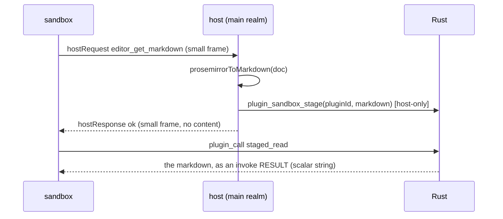

# §260 Phase 4b — the sandboxed tier reads and edits the document

Issue #260, after Phase 4a merged (PR #305, `e1e845c`). Branch: `feat/plugin-editor-access-260`.

## Why this slice

After 4a a sandboxed plugin can orient itself (context-relative paths, delivered file
events) and report (toast + status bar). It still cannot touch the one thing a markdown
editor's plugins exist for: **the document**. That is the whole of 4b.

Deferred to 4c: document/selection **transform** contributions, declarative `settings`,
`menu` mapping, sidebar panels. Those are separate contribution *kinds* with their own
registration models; the editor ops are a service, like `ai` and `ui`.

## The blocking problem: a document does not fit in a frame

`src-tauri/src/plugin/channels.rs:98-117` already says it:

> a frame ≥ 8 KiB is staged in tauri's app-global `ChannelDataIpcQueue` and fetched by the
> webview through `FETCH_CHANNEL_DATA_COMMAND`, which is **ACL-EXEMPT** and takes only a
> guessable sequential id — so another sandbox could race that fetch and steal (and wedge)
> this frame. Every frame we send today is far under it; warn loudly in dev if that ever
> stops being true. …**chunk it before this ships**

`editor.getMarkdown()` is what stops it being true. A 10,000-line document — Baram's
stated target — is hundreds of KiB, so every read would put **the user's document text**
into a queue any other sandboxed plugin can fetch by guessing a small integer.

Note which direction is affected. Only **host → sandbox** rides `ipc::Channel`.
Sandbox → host goes `plugin_sandbox_report` → Rust re-emits `plugin:s2h`, and a sandbox
holds no `core:event:*` permission (3c-2a), so it cannot eavesdrop there; that direction is
already capped at 8 MiB and needs nothing new. **Writes are fine today; reads are not.**

### Chosen fix: stage in Rust, pull as an invoke RESULT

3c-2b already solved this exact problem for a different large payload — the plugin's own
bundle. `SourceRead` returns it as a **`plugin_call` result**, not a frame, because
`ipc/protocol.rs` returns an invoke result through the custom-protocol path (an HTTP body)
and, even on the postMessage fallback, a **bare JSON string never matches** the `{`/`[`
condition that routes into the shared queue. That mechanism is tested, and its invariant is
documented at `sandbox-client.ts`.

So: same shape, different source.



- **Always staged, never size-branched.** A conditional "inline if small, stage if large"
  path would put a behaviour change exactly on the 8 KiB boundary — which is where every
  bug in this class has lived. One path costs one extra IPC round trip on small documents
  and buys a boundary that cannot be crossed by accident.
- **Label-keyed, like every other per-plugin resource.** Rust resolves the slot from
  `window.label()` on the pull, never from an argument (the storage-isolation rule, and the
  same reason `SourceRead` takes no path).
- **Consume on read**, one slot per plugin. A staged document must not linger in memory
  after delivery, and a consumed slot cannot be replayed.
- **Capped** at `MAX_PLUGIN_FILE_BYTES` (8 MiB), measured with the existing
  `serialized_len_capped`/`metadata` never-allocate-to-measure rule.
- `plugin_sandbox_stage` is **host-only** (`host_window_guard`), so a sandbox cannot stage
  into anyone's slot, including its own.

Rejected alternative — **chunking the frames**: generic, but it invents a reassembly state
machine (ids, sequence, totals, partial-delivery failure, abort) in the realm boundary,
where new failure modes are most expensive. Staging reuses a delivery path already proven
and already tested. If a future payload must be *pushed* (a transform's input document, 4c),
staging covers that too: send a small "handle X" frame, let the sandbox pull.

**Cost, stated plainly:** one new Tauri command, so the Phase-3b ACL machinery moves —
`build.rs` `AppManifest::commands`, `capabilities/default.json`, `capabilities/plugin-sandbox.json`
(host-only ⇒ NOT granted there), `ipc-registry.json`, and `src-tauri/tests/acl_lockdown.rs`
whose sandbox allowlist is an exact-array assertion. Mechanical but not free.

## Two pre-existing API defects this slice must not inherit

Found while reading `extension-context.ts` for this plan:

1. **`getSelection().text` mixes coordinate systems.** It does
   `editorInstance.getText().slice(from, to)`, where `from`/`to` are ProseMirror document
   positions (which count node boundaries) and `getText()` is a flat string. They diverge as
   soon as the document has more than one block, so the returned `text` is wrong for
   essentially every real document. The app's own AI code already uses the correct idiom
   (`state.doc.textBetween(from, to)`, `utils/ai-commands.ts:107`). Fix in the trusted tier
   too — it is a plain bug, not a tier difference.
2. **`getContent()` returns flat text from a markdown editor**, while `setContent()` hands
   its argument to Tiptap's `setContent`, which parses HTML/JSON — so what you read is not
   what you can write back. Rather than redefine the trusted tier's methods (a breaking
   change for installed plugins), the sandboxed tier gets its own interface with names that
   say what crosses:

```ts
export interface SandboxEditorAPI {
  getMarkdown(): Promise<string>;
  getSelection(): Promise<{ from: number; text: string; to: number }>;
  insertText(text: string): Promise<void>;
  setMarkdown(markdown: string): Promise<void>;
}
```

`getMarkdown`/`setMarkdown` go through `prosemirrorToMarkdown` / `markdownToProsemirror`,
the app's own round-trip pipeline — so a plugin reads exactly what it can write back, which
is the project's first-class quality criterion (round-trip preservation).

## Capability gating

- `editor:readonly` admits `getMarkdown` and `getSelection`.
- `editor` admits those **plus** `insertText` and `setMarkdown`.
- Any-of, like `files`/`files:readonly` — `CapabilityRequirement::AnyOf` already exists for
  the Rust side, and the host bridge does the same for the mediated ops.
- A write must be **one undoable transaction** and must mark the document dirty through the
  normal path, or a plugin edit would be invisible to autosave and unrecoverable by undo.

## Tasks

| # | Task |
|---|---|
| 1 | Rust: `StagedPayloads` (label-keyed, consume-on-read, capped) + host-only `plugin_sandbox_stage` + `PluginOp::StagedRead` + ACL/manifest/registry/guardrail updates |
| 2 | Protocol + client: `editor_*` host requests, `SandboxEditorAPI` hiding the stage/pull round trip behind a plain promise |
| 3 | Host bridge: `host-editor-bridge.ts` — capability gate, markdown serialise/parse, one-transaction writes; routed by `host-request-router` |
| 4 | Fix `getSelection` in the trusted tier (`textBetween`) |
| 5 | Fixture + docs + `types:plugin` regen |

## Verification plan

- **Mutation-verify every new guard**, as in 4a: the capability gate (readonly admits reads,
  refuses writes), the host-only guard on staging, label-keying of the slot, consume-on-read,
  the size cap.
- **One test must assert the payload never rides a frame** — i.e. that the `hostResponse` for
  `editor_get_markdown` carries no document text. That is the property the whole design is
  for, and it is the one a future refactor would silently break.
- **A large-document test**: stage and pull a payload well over 8 KiB and assert the frame
  stayed small (`serialized_len_capped`), which is the Rust-side half of the same property.
- **Round-trip test**: `getMarkdown` → `setMarkdown` of the same string leaves the document
  byte-identical, using the project's existing round-trip fixtures.
- **Live smoke** (user-run): read a real note, check the length matches, insert text, undo it
  with Cmd+Z, and confirm the editor is marked dirty. Plus: a second sandboxed plugin present
  at the same time, to sanity-check that the staged slot is per-plugin.

## Carried in from 4a — do these here

- `menu[].command` / `settings[].key` still need `requireId` when 4c reads them (not this
  slice, but the note must survive).
- `replayCurrentState` hardcodes `"file:open"` and translates outside `EVENT_PAYLOADS` —
  fold it into the record while editing that file.
- `ui` shares the 4-slot in-flight budget with `ai`; `editor` will now share it too, and a
  staged read holds a slot for two round trips. Re-examine `MAX_INFLIGHT_HOST_REQUESTS`.
