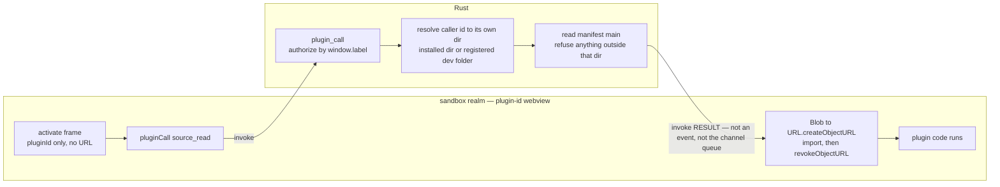

# Plugin Sandbox `blob:` Code Delivery (§260 Phase 3c-2b) Implementation Plan

> **For agentic workers:** Steps use checkbox (`- [ ]`) syntax. Implement task-by-task, run the stated test after each step, commit per task.

**Goal:** Close F1 from the 3c-2a security review at the root: remove `asset:` from the sandbox realm entirely, so a sandboxed plugin loses the **file-read capability the broker never granted it**. The sandbox asks Rust for its *own* bundle through `plugin_call`, imports it from a `blob:` URL, and its CSP drops to `script-src 'self' blob:`. Also land the Q2 in-flight-teardown race the 3c-2a re-review deferred.

**Why `asset:` is a capability, not a convenience:** Tauri v2's asset scope is **app-global** — there is no per-webview scope — and at runtime it covers `$APPDATA/**`, the plugins directory **recursively from the parent** (`plugin_prepare_scopes` → `allow_directory(dir, true)`), every registered dev folder (`dev_info`), and **the open vault root** (`set_vault_root` → `allow_directory(path, true)`). With `asset:` in `script-src`, a malicious sandboxed plugin can `import('asset://localhost/…')` any valid-JS file in those trees — another plugin's bundle, a `.js` note in the user's vault — and probe paths from the error shape (possibly leaking source fragments, since a module `SyntaxError` can echo tokens). `connect-src` omits `asset:`, which bounds but does not close it. Narrowing `plugin_prepare_scopes` per-plugin would only kill the cross-plugin half; the vault must stay in scope for the main realm's own attachments.

**Why `blob:` is not the same hazard:** a `blob:` URL can only be built from bytes the realm already holds, so it grants **no** file access. Executing attacker-authored code is not a new privilege — the plugin's own bundle is attacker-authored either way. The sandbox's power comes from its ACL, which is unchanged.

**Why the source travels over `plugin_call` and not the activate frame:** a bundle is easily >8 KiB, and any `ipc::Channel` frame at or above tauri's 8 KiB direct-eval threshold is staged in the **app-global** `ChannelDataIpcQueue` and fetched via `FETCH_CHANNEL_DATA_COMMAND` — which is hardcoded ACL-exempt with a guessable sequential id (3c-2a review I3), so another sandbox could steal it and permanently wedge the channel. A `plugin_call` **response** is an invoke result: not an event, not the channel, not the queue. Routing the bundle there sidesteps the whole class and means h2s chunking is **not** needed in this phase.

**Tech Stack:** Rust (Tauri v2 commands, `PluginOp`, path canonicalization), TypeScript (`Blob`/`URL.createObjectURL`, dynamic `import()`), Vitest + `cargo test`.

## Global Constraints

- **Scope = code delivery + the deferred teardown race.** In: `PluginOp::SourceRead` + caller-scoped resolution in Rust; sandbox-side blob import; the activate frame dropping `pluginUrl`; sandbox CSP `asset:` → `blob:`; the Q2 in-flight teardown map; ADR/plan updates. **Deferred to 3c-2c:** brokered `files` ops (Rust broker, `files`/`files:readonly` any-of authz, vault-bounded) and host-mediated `ai` RPC (its own protocol request/response frames). **Deferred to 3c-3:** the LIVE user-run smoke — which this phase must precede, because it changes how a plugin is loaded. **Deferred:** h2s chunking (no longer needed for source; keep the dev 8 KiB warning for Phase-4 growth).
- **Plugins stay OFF** (`VITE_ENABLE_PLUGINS`) and sandbox-webview creation stays dev-gated (`isSandboxRuntimeAllowed`).
- **The sandbox must not gain a general file read.** `SourceRead` takes **no path argument**: Rust resolves the caller's own directory from the label-derived id and reads only `manifest.main` inside it, canonicalizing to refuse traversal. A plugin cannot name another plugin's file.
- **No new host-only read command.** Adding a "read any plugin file" command for `main`/`file-*` would hand the trusted realm an unconstrained reader (`read_file` is vault-bounded on purpose). Keep the read inside the authorized `plugin_call` path.
- **Trusted tier untouched.** It keeps `convertFileSrc` + `asset:`; only the sandbox realm loses it. The global CSP keeps `asset:` for that reason.
- **TS conventions:** `import type` (`verbatimModuleSyntax`), files ≤ ~300 lines, `useShallow` for any Zustand selector.
- **`src/plugins/types.ts` edits require `npm run types:plugin`** + committing `examples/plugins/*.d.ts` (recurring §260 CI trap).

---

### Task 1: Rust — `PluginOp::SourceRead`, resolved from the caller's own identity

**Files:**

- Modify: `src-tauri/src/plugin/authorizer.rs` (`required_capability` → optional), `src-tauri/src/plugin/mod.rs` (id → own-dir resolution + bundle read), `src-tauri/src/commands/plugin_cmd.rs` (`execute_op` arm; `plugin_call` gains `AppHandle` for dev-folder config)
- Test: unit tests beside each

**Interfaces:**

- Produces: `PluginOp::SourceRead` returning the plugin's `main` bundle as a JSON string; `plugin::read_own_source(app, plugin_id) -> Result<String, String>`.
- Consumes: `get_plugin_dir`, `read_manifest`, `read_manifest_at`, `parse_dev_folders` (dev folders live in config under `plugin.devFolders`).

- [ ] **Step 1: Write the failing tests.** In `authorizer.rs`: `SourceRead.required_capability()` is `None` while storage/network keep `Some(..)`, and `authorize` admits a **registered** sandbox for a `None`-capability op even with an empty granted set, but still rejects an unregistered or non-sandbox caller. In `mod.rs`: resolution refuses an id that escapes the plugin dir (`../`, absolute, separators — reuse the existing single-segment guard) and refuses a `main` that resolves outside the plugin's own directory.
- [ ] **Step 2: Run them, watch them fail** — `cd src-tauri && cargo test plugin`.
- [ ] **Step 3: Make the capability optional.** `required_capability(&self) -> Option<&'static str>`; `SourceRead => None`. In `PluginAuthorizer::authorize`, accept a `None` requirement as "registered is enough" (identity still verified, still fails closed for an unknown label). Update the 3a tests and `plugin_call`'s call site. Comment WHY reading one's own code needs no grant: it is the bytes the host was about to hand over anyway, and the caller cannot name any other file.
- [ ] **Step 4: Implement `read_own_source`.** Resolve the id: `get_plugin_dir()/<id>` if it exists, else scan `parse_dev_folders(config)` for a folder whose `read_manifest_at` id matches. Read `manifest.main` joined to that dir, `canonicalize` both, and refuse if the file is not inside the resolved dir. Return the text.
- [ ] **Step 5: Wire the `execute_op` arm** and give `plugin_call` the `AppHandle` it needs for dev-folder config. Keep `Result<T, String>` at the edge.
- [ ] **Step 6: Run tests + `cargo clippy --all-targets`; `cargo fmt --check`** (the rust CI job runs fmt; the pre-push hook does not).
- [ ] **Step 7: Commit** — `feat(§260): brokered SourceRead so a sandbox can load its own bundle (Phase 3c-2b)`.

---

### Task 2: TS — blob import in the sandbox, `pluginUrl` out of the protocol

**Files:**

- Modify: `src/plugins/sandbox/plugin-op.ts` (variant), `src/plugins/sandbox/protocol.ts` (activate frame), `src/plugins/sandbox/sandbox-client.ts` (fetch → blob → import → revoke), `src/plugins/sandbox/sandbox-session.ts` + `sandbox-host.ts` (stop passing a URL)
- Test: `src/plugins/sandbox/__tests__/sandbox-client.source.test.ts`; update existing sandbox suites

**Interfaces:**

- Produces: `{ kind: "source_read" }` op; `HostToSandbox` activate carries `pluginId` only; `startSandboxClient`'s importer becomes `(source: string) => Promise<PluginModule>` with the blob dance in the default implementation (injectable, so tests never touch `URL.createObjectURL`).

- [ ] **Step 1: Write the failing test.** Drive `activate`; assert the client (a) calls the broker with `{kind:"source_read"}`, (b) passes the returned text to the injected importer, (c) reports `ready` afterwards, and (d) reports `activateError` — not a hang — when the source read rejects.
- [ ] **Step 2: Run it, watch it fail.**
- [ ] **Step 3: Implement.** `onActivate` asks the broker for the source, then `importer(source)`. Keep `assertSerializable` and the re-activation guard. In `sandbox-entry.ts`, the real importer builds `new Blob([src], { type: "text/javascript" })`, imports the object URL, and **revokes it in a `finally`** so a long-lived sandbox does not leak URLs.
- [ ] **Step 4: Drop `pluginUrl`** from `protocol.ts`, `SandboxSession.activate`, and `SandboxHost.start` (which no longer needs `convertFileSrc` — check whether the import is now unused). Note in the comment that the manifest's `main` is resolved in Rust now.
- [ ] **Step 5: Run `npm test -- sandbox`** and fix the existing suites' call sites; `npm run typecheck`.
- [ ] **Step 6: Commit** — `feat(§260): load sandboxed plugins from a blob: URL, drop pluginUrl (Phase 3c-2b)`.

---

### Task 3: CSP — `asset:` out of the sandbox realm

**Files:** Modify `sandbox.html`

- [ ] **Step 1: Replace** `script-src 'self' asset: http://asset.localhost` with `script-src 'self' blob:`. Rewrite the KNOWN RESIDUAL comment: the residual is **gone**, and the note becomes why `blob:` is safe (no file access; the sandbox can only run bytes it was handed) plus the constraint it imposes — a sandboxed plugin must ship a **single bundled ESM**, because a `blob:` module has no base URL so relative or bare specifiers do not resolve.
- [ ] **Step 2: Verify** `npm run build` (sandbox.html is a Vite entry). Effective-CSP proof belongs to the 3c-3 smoke.
- [ ] **Step 3: Commit** — `fix(§260): drop asset: from the sandbox CSP, allow blob: (Phase 3c-2b)`.

---

### Task 4: Manifest validation — a sandboxed plugin must be single-bundle

**Files:** Modify `src/plugins/plugin-validation.ts` (or wherever `validateManifest` lives), test alongside

- [ ] **Step 1: Write the failing test** — a `trust: "sandboxed"` manifest declaring `tiptapExtensions` (already meaningless for the sandbox tier) or a `main` that is not a single file is rejected with a message naming the bundling requirement.
- [ ] **Step 2: Implement** the check, with a comment tying it to the `blob:` base-URL constraint from Task 3. Keep the trusted tier's rules unchanged.
- [ ] **Step 3: Run** `npm test -- plugin-validation`; **commit** — `feat(§260): require a single bundled ESM for sandboxed plugins (Phase 3c-2b)`.

---

### Task 5: Close the deferred teardown race (3c-2a Q2)

**Files:** Modify `src/plugins/plugin-loader.ts`, test in `src/plugins/__tests__/plugin-loader.sandbox.test.ts`

**Why:** on the outer 5 s teardown timeout the in-flight `plugin_sandbox_deregister` can still land **after** a subsequent `plugin_sandbox_register` and revoke the new grant — I2's failure mode behind a five-second door. No timeout can fix it (`withTimeout` cannot cancel an IPC), and the symptom is a plugin that silently fails to load with no visible link to the log line.

- [ ] **Step 1: Write the failing test** — teardown's deregister hangs past the outer timeout; a subsequent `loadPlugin` for the same id must **wait** for it rather than registering first. Assert the call order ends `…deregister → register`.
- [ ] **Step 2: Implement** a `Map<pluginId, Promise<void>>` of in-flight teardowns: populated in `unloadPlugin` with the **un-timed-out** promise (so the entry outlives the timeout), awaited at the top of `loadSandboxedPlugin` before `pluginSandboxRegister`, and deleted in a `finally`. Bound that await too, so a permanently hung teardown degrades to today's behaviour rather than blocking loads forever.
- [ ] **Step 3: Run** `npm test -- plugin-loader`; **commit** — `fix(§260): serialise sandbox load behind an in-flight teardown (Phase 3c-2b)`.

---

### Task 6: Docs — ADR + the recurring-lesson trail

**Files:** Modify `dev/superpowers/specs/2026-07-23-plugin-execution-model-260-design.md`

- [ ] **Step 1:** Update the "Sandbox code delivery" section from *decided* to *implemented*, recording what actually shipped (source over `plugin_call`, not the activate frame — with the queue-threshold reason), that F1 is **closed** rather than mitigated, and that h2s chunking is consequently not needed yet. Note the single-bundle requirement as a plugin-author-visible constraint.
- [ ] **Step 2: Commit** — `docs(§260): record blob: code delivery as implemented (Phase 3c-2b)`.

---

## Verification (before PR / merge)

- `npm test` — full suite green.
- `npm run typecheck` — clean (3 projects); `npm run lint` — clean (**includes `types:plugin:check`**, so commit regenerated `examples/plugins/*.d.ts` if `types.ts` changed).
- `cd src-tauri && cargo test && cargo clippy --all-targets && cargo fmt --check` — clean.
- `npm run build` + `cargo build` — clean.
- **Boundary re-audit for the PR body:** enumerate what the sandbox realm can now read. Expected: nothing by path — `SourceRead` names no file, `storage` is namespaced by caller id, `network` is `network`-gated, and there is no `asset:`.

## Self-Review notes

- **Does this actually close F1?** Yes, structurally: with no `asset:` in `script-src`, an `import('asset://…')` is refused by CSP regardless of the app-global asset scope, and `connect-src` still omits it so `fetch` cannot substitute. The sandbox's only route to bytes is `plugin_call`, where Rust picks the file.
- **New attack surface?** One op that takes no arguments and resolves against the caller's Tauri-verified identity. The read is confined to the plugin's own directory by canonicalization. Worst case a plugin reads its own code, which it already ships.
- **Does it dodge I3 rather than inherit it?** Yes — the bundle returns as an invoke *result*, so it never enters the shared channel-data queue that `FETCH_CHANNEL_DATA_COMMAND` exposes. That is the reason for this shape and is worth stating in the PR body, since "just put it in the activate frame" is the obvious-looking alternative.
- **Cost to plugin authors:** a sandboxed plugin must ship one bundled ESM (no sibling imports from a blob URL). Task 4 makes that a validation error instead of a confusing runtime failure — better found at install than in the 3c-3 smoke.
- **Ordering:** this must land before 3c-3, since it changes how a plugin is loaded and the smoke is a scarce, user-run gate.
