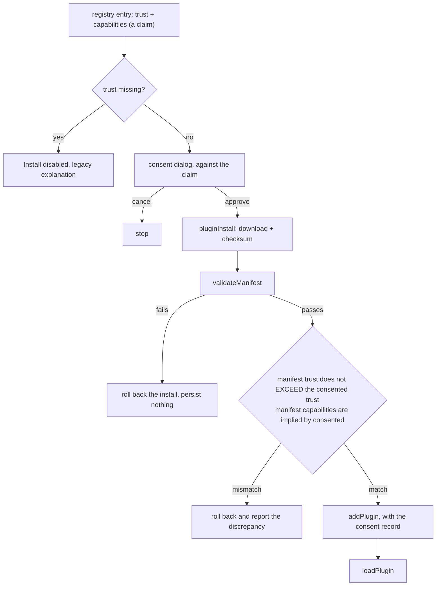

# §260 Phase 5 — Release-gate lift, install consent, registry cross-check

Status: approved 2026-07-28. Implements ADR §10 phase 5
(`dev/superpowers/specs/2026-07-23-plugin-execution-model-260-design.md`), which reads
"Trusted-tier full-trust opt-in dialog + registry `trusted` flag + release-gate
transition", plus the two blockers that turned up while scoping it.

Phases 1–4c are merged. This is the phase where sandboxed plugins become reachable by
real users, so its criterion for inclusion is narrow: **does this have to be true before
untrusted plugin code runs in a packaged build?** Everything else is deferred with a
reason at the end.

## 1. What the gate actually is

Two independent gates, discovered to be different mechanisms:

| Layer | Mechanism | Guards |
| --- | --- | --- |
| Frontend | `import.meta.env.VITE_ENABLE_PLUGINS === "1"` (`plugins-enabled.ts`) | auto-load, load, marketplace UI, sandbox-webview creation (the last also requires `import.meta.env.DEV`) |
| Rust | `cfg!(debug_assertions)` (`plugin/mod.rs::plugins_runtime_enabled`) | `plugin_install`, `plugin_prepare_scopes`, `plugin_add_dev_folder`, `plugin_http_fetch`, `plugin_storage_write` |

`plugin_call` is deliberately outside both (`plugin_cmd.rs:947`) — Phase 3a put it there
for this moment.

### Decision: the frontend gate is deleted; the Rust gate is split, not flipped

Four of the five Rust-guarded commands are load-bearing for the sandboxed tier and open
in release. `plugin_add_dev_folder` is not: side-loading an arbitrary directory bypasses
the checksum, the registry, and (after this phase) the consent record, and it exists to
serve plugin authors, who run dev builds. It keeps its gate.

So `plugins_runtime_enabled()` is **renamed to `dev_plugin_loading_enabled()`** and keeps
exactly one caller. A function whose name says "plugins work" while it gates only dev
side-loading is the kind of name that gets misread into a hole later.

`plugins-enabled.ts` is deleted outright, along with the four call-site branches. A
kill-switch constant that is always `true` is dead code wearing the costume of control.

## 2. CSP: `blob:` joins the global `script-src`

The sandbox realm imports the plugin bundle from a blob URL. A `<meta>` CSP can only
tighten the served policy, and in a packaged build Tauri serves every `.html` asset with
the global `csp` from `tauri.conf.json` as a header, so `blob:` must be in the global
`script-src` or sandboxed plugins cannot load at all in release.

**Two findings that narrow this decision, neither previously recorded:**

1. **Only `script-src` matters.** `sandbox.html` also asks for `connect-src ipc:
   http://ipc.localhost`, which the global policy lacks — but that is survivable, and
   silently already the case for the whole app: `tauri-2.11.5/scripts/ipc-protocol.js`
   tries the custom-protocol `fetch` first and, on any failure including a CSP block,
   sets `customProtocolIpcFailed = true` and falls back permanently to
   `window.ipc.postMessage`. A blocked module script has no such fallback. The existing
   guardrail test compares `script-src` only, which turns out to be exactly right for a
   reason nobody had written down.

2. **The app already permits blob-sourced code execution.** The global CSP contains
   `worker-src 'self' blob:`. A blob Worker runs attacker-controlled code in the app's
   own origin today. What `script-src blob:` adds on top is DOM access — real, but a much
   smaller step than "blob code can now run". And minting a blob URL requires script
   execution already, so the paths CSP exists to contain here (raw HTML in a markdown
   document, with no `'unsafe-inline'`/`'unsafe-eval'`) do not reach it.

Rejected alternatives, recorded so they are not re-litigated:

- **`plugin-src://` custom scheme serving the bundle**, Rust-gated on `webview_label()`
  so the global allowance is inert for the main realm. Strictly better isolation, and
  the right answer if `blob:` ever proves to be a problem — but ~150 lines of Rust plus a
  client rewrite to buy back a step the app has already taken with `worker-src`.
- **Custom scheme serving the whole sandbox document.** Also fixes §5's origin sharing
  and touches the global CSP not at all. Rejected because dev (Vite dev server) and
  release (custom scheme) would load the sandbox by different paths — reproducing exactly
  the "the live smoke runs in dev and cannot catch this" failure that created this
  decision.

### Test: invert the guardrail

`plugins-enabled.csp.test.ts` currently asserts "if the global is missing something the
sandbox needs, sandbox creation must be dev-gated". Once the gap is closed that predicate
short-circuits on `missing.length === 0` and the test passes without asserting anything —
a hollow test, and its `sandboxIsDevGated()` helper loses its subject when
`plugins-enabled.ts` is deleted.

Replace it with the positive form: **every source in the sandbox's `script-src` must
appear in the global `script-src`**, with the failure message explaining that a meta CSP
cannot widen. Widening the sandbox CSP later then forces the same deliberation instead of
silently working in dev and failing in release. The second test (`asset:` stays out,
`default-src 'none'`) is unchanged.

## 3. Install consent

The ADR's own residual: *"the install UI displays the requested capabilities
(`PluginDetail.tsx`), but there is no separate grant step; the loader passes
`manifest.capabilities` straight through. A dedicated consent/opt-in flow is Phase 5
work."* Today that display is a `window.confirm` in `PluginMarketplace.handleInstall`.

There is also an escalation path with no check at all: a plugin installed as `sandboxed`
whose next version declares `trust: "trusted"` is promoted to full main-realm power by
`onUpdate` without asking anything.

### Model: record the consented shape, re-ask only when it is exceeded

`InstalledPlugin` gains a snapshot taken at the moment the user agreed (plugin store
persist version 2 → 3; existing records migrate by synthesising consent from the manifest
they already hold — they can only exist in dev builds):

```ts
interface PluginConsent {
  capabilities: PluginCapability[];
  trust: PluginTrust;
}
```

The rule is a pure function in a new `src/plugins/plugin-consent.ts`:

```
consentRequired(consented, next):
  consented is absent                              → "first-install"
  next.trust === "trusted" && consented.trust !== "trusted" → "escalation"
  some capability in next is not implied by consented       → "escalation"
  otherwise                                        → null
```

**"implied by", not "a member of".** `files` implies `files:readonly` and `editor`
implies `editor:readonly`, so a plain subset test would prompt on an update that
*narrows* a grant (`files` → `files:readonly`) — a false positive that trains users to
click through. The implication table lives next to the rule; it is the only place in the
codebase that needs to know these pairs are ordered, and `CapabilityRequirement::AnyOf`
in Rust already encodes the same relationship for authorization.

One mechanism closes both the ADR residual and the escalation path, rather than a consent
flow for capabilities and a separate tier check for updates.

### Scope of the dialog

- **Registry installs and updates**: consent required per the rule above.
- **Dev-folder loads**: no consent record. Choosing a directory is already an explicit,
  deliberate act and the tier badge is shown; requiring consent there would only add
  friction to the smoke fixture. A `trusted` manifest still gets the full-trust warning.

## 4. Registry cross-check

Consent is collected **before** the download, against `RegistryEntry.trust` and
`RegistryEntry.capabilities` — which are a *claim* made by the registry, not the truth.
The manifest inside the ZIP is the truth. Without a check that they agree, the consent
step is theatre: a registry (or a compromised download URL) could advertise `sandboxed`
and ship `trusted`.



Every check lands **before** `addPlugin`. That also closes a gap noted in Phase 4c and
never fixed: `handleInstall` persists the record at `PluginMarketplace.tsx:314` and only
then calls `loadPlugin`, whose `catch` merely calls `setError` — so a manifest that fails
validation stays in the store. Worse, a plugin declaring `tiptapExtensions` skips
`loadPlugin` entirely, so its manifest is never validated at all. Moving validation ahead
of persistence fixes both without a separate change.

## 5. Same-origin: remove `localStorage` as a shared surface

`sandbox-host.ts:140` creates each sandbox with a **relative** URL
(`sandbox.html?label=…`), so every `plugin-*` webview shares an origin with the main
window. Consequence: shared `localStorage`.

Nearly every store already persists through `tauriStorage` (Rust `config.json`). Two do
not:

- `src/stores/ui/journal-layout.ts` — `persist(..., { name: "baram:journal-layout" })`
  with no `storage`, i.e. `localStorage`.
- `src/stores/file/bookmark.ts` — raw `localStorage.getItem/setItem` under
  `baram:bookmarks:{vaultRoot}`, holding the vault root path, file paths and heading text.

A sandboxed plugin with **zero capabilities** can read and write both. That is an
ungranted read of vault structure, and it ships to real users the moment the gate lifts.

Fix: move both to `tauriStorage`. `journal-layout`'s key joins `MIGRATION_KEYS` in
`tauri-storage.ts`. Bookmarks cannot — the key is per vault root, so a static list cannot
enumerate them; they need a **prefix sweep** over `localStorage` keys beginning with
`baram:bookmarks:`.

Guard: a source-scan test asserting `localStorage` appears only in `tauri-storage.ts` and
its startup caller. This is precisely the kind of thing that regresses in a later feature,
and the cost of catching it is one test.

## 6. Legacy registry entries

The live registry (`sayinel.github.io/baram-plugins/index.json`, updated 2026-07-16)
contains two plugins, **both without a `trust` field** — they predate the Phase 1 tier
model. `validateManifest` rejects a trust-less manifest, so today clicking Install
downloads, then fails with a validation error.

Fix: an entry with no `trust` renders with its Install button disabled and an explanation
(the badge already reads "Legacy — needs re-validation"). Cheap, and it stops the
marketplace's first impression from being an error dialog.

Porting those two plugins is Phase 6 and is **not** blocked by this phase — the gate lift
lands in `main`, and the registry only has to be current before the next release tag.
Worth noting for that phase: `baram-word-count` (`editor:readonly`, `events`,
`statusbar`) is portable today, while `baram-ai-summary` needs `sidebar`, which Phase 4
deferred.

## 7. Testing

- **Unit, pure**: `consentRequired` — first install, tier escalation, capability
  addition, capability narrowing (the implication cases), and the exact-match no-op.
- **Unit, cross-check**: manifest-vs-claim agreement, including the mismatch that must
  roll back rather than persist.
- **Component**: the consent dialog renders capabilities and the trusted danger section;
  cancel installs nothing; the update variant shows what grew.
- **Source-scan guards**: the inverted CSP test; the `localStorage` allowlist test.
- **Store migration**: v2 → v3 synthesises consent; bookmark prefix sweep moves keys and
  removes them.
- **Live smoke**: unchanged fixture, but now exercised from a **packaged build** — that
  is the whole point of this phase, and the one thing no unit test can stand in for.

Every new guard gets mutation-tested before it is trusted: three tests written in Phase
4c passed against the unfixed code.

## 8. Deferred, with reasons

- **`plugin-src://` custom scheme** (§2) — better than `blob:`, not better enough to pay
  for now that `worker-src blob:` is known to be already present.
- **Per-plugin origin isolation** (§5) — `plugin-*` windows still share an origin with
  each other, so two installed plugins can collude over `BroadcastChannel` or
  `SharedWorker`. Both must be installed by the user, and a `network`-granted accomplice
  is required for exfiltration; this is a materially weaker threat than the ungranted
  `localStorage` read, which this phase closes. Record it in the ADR's Bounds section.
- **Phase 4 remainder** — `menu`, document transforms, declarative sidebar panels,
  `commands.execute` of app commands. None gate the release transition.
- **Phase 6** — reference-plugin port and the malicious-fixture CI.
