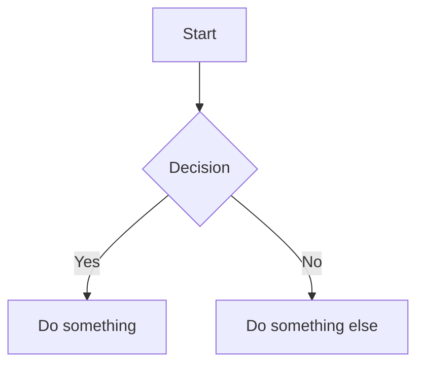

# Baram User Guide

Welcome to Baram — a lightweight, beautiful WYSIWYG markdown editor with AI integration and bidirectional links.

---

## Table of Contents

- [Getting Started](#getting-started)
- [Writing Documents](#writing-documents)
- [Formatting](#formatting)
- [Rich Content](#rich-content)
- [Linking & Navigation](#linking--navigation)
- [Source Mode](#source-mode)
- [Find & Replace](#find--replace)
- [AI Features](#ai-features)
- [Git Integration](#git-integration)
- [Export](#export)
- [Journal / Daily Notes](#journal--daily-notes)
- [Workspace Presets](#workspace-presets)
- [Customization](#customization)
- [Help Panel](#help-panel)

---

## Getting Started

### Installation

Download the latest release for your platform from the [Releases](https://github.com/sayinel/baram/releases) page.

| Platform | Format |
|----------|--------|
| macOS (Apple Silicon / Intel) | `.dmg` |
| Windows (x64 / ARM) | `.msi`, `.exe` |
| Linux (x64) | `.deb`, `.AppImage` |

Alternatively, [build from source](../README.md#build-from-source).

### First Launch

When you first open Baram, a Welcome screen greets you with two options:

- **Open Folder** — Open an existing folder of markdown files
- **New File** — Create a fresh document

### Interface Overview

Baram uses a 3-column layout:

```
┌──────────┬──────────────────────────────┬─────────────┐
│          │         Tab Bar              │             │
│  Left    │                              │   Right     │
│ Sidebar  │       Main Editor            │  Sidebar    │
│          │       (WYSIWYG)              │             │
│ File Tree│                              │  Outline    │
│ Backlinks│                              │             │
│ Bookmarks│                              │             │
├──────────┴──────────────────────────────┴─────────────┤
│                     Status Bar                        │
└───────────────────────────────────────────────────────┘
```

- **Left Sidebar** — File tree, backlinks panel, bookmarks, global search, and Git source control. Toggle with `Cmd+Shift+L` (macOS) / `Ctrl+Shift+L` (Windows/Linux).
- **Main Editor** — The WYSIWYG editing area where you write.
- **Right Sidebar** — Document outline showing heading structure, or AI Chat panel.
- **Status Bar** — Shows word count, line count, and cursor position.

> By default, both sidebars are hidden to maximize writing space. The editor follows the principle of **minimal interface** — only showing what you need, when you need it.

---

## Writing Documents

### Creating and Opening Files

| Action | macOS | Windows/Linux |
|--------|-------|---------------|
| New File | `Cmd+N` | `Ctrl+N` |
| Open File | `Cmd+O` | `Ctrl+O` |
| Save | `Cmd+S` | `Ctrl+S` |
| Save As | `Cmd+Shift+S` | `Ctrl+Shift+S` |
| Close Tab | `Cmd+W` | `Ctrl+W` |
| Quick Switcher | `Cmd+K` | `Ctrl+K` |

You can also open files from the file tree in the left sidebar, or use the **Quick Switcher** (`Cmd+K`) for fast file and heading navigation.

### Tabs

Baram supports multiple open files via tabs at the top of the editor.

- **Switch tabs** — Click on a tab, or use `Ctrl+Tab` / `Ctrl+Shift+Tab` for MRU (Most Recently Used) tab switching
- **Close tab** — Click the `×` on the tab, or press `Cmd+W`
- **Pin tab** — Right-click a tab and select "Pin Tab". Pinned tabs show as compact icons and can't be accidentally closed
- **Undo history preserved** — Each tab maintains its own undo/redo history, even when switching between tabs

### Quick Switcher

Press `Cmd+K` (macOS) or `Ctrl+K` (Windows/Linux) to open the Quick Switcher. Type to search for:

- **Files** — Quickly open any file in your workspace
- **Headings** — Type `#` to filter by heading, then jump directly to a heading in any file

### Auto-Save

Your documents are automatically saved as you type. A dot indicator on the tab shows unsaved changes — they are saved shortly after you stop typing.

### Undo and Redo

| Action | macOS | Windows/Linux |
|--------|-------|---------------|
| Undo | `Cmd+Z` | `Ctrl+Z` |
| Redo | `Cmd+Shift+Z` | `Ctrl+Shift+Z` |

---

## Formatting

### Inline Formatting

Baram hides markdown syntax while you write. The delimiters appear when your cursor enters the formatted text, and vanish when you move away.

| Format | Syntax | Shortcut (macOS) | Shortcut (Win/Linux) |
|--------|--------|-------------------|----------------------|
| **Bold** | `**text**` | `Cmd+B` | `Ctrl+B` |
| *Italic* | `*text*` | `Cmd+I` | `Ctrl+I` |
| <u>Underline</u> | `<u>text</u>` | `Cmd+U` | `Ctrl+U` |
| ~~Strikethrough~~ | `~~text~~` | `Cmd+Shift+X` | `Ctrl+Shift+X` |
| ==Highlight== | `==text==` | `Cmd+Shift+H` | `Ctrl+Shift+H` |
| Superscript | `^text^` | — | — |
| Subscript | `~text~` | — | — |
| `Inline Code` | `` `text` `` | `Cmd+E` | `Ctrl+E` |
| [Link](url) | `[text](url)` | `Cmd+K` | `Ctrl+K` |
| Inline Math | `$formula$` | Type `$...$` | Type `$...$` |

You can also apply formatting by selecting text and using the **Floating Toolbar** that appears above the selection. The toolbar includes buttons for Bold, Italic, Strikethrough, Highlight, Superscript, Subscript, Code, and more.

### Block Formatting

#### Headings

Type `#` through `######` followed by a space to create headings H1–H6. You can also use shortcuts:

| Action | macOS | Windows/Linux |
|--------|-------|---------------|
| Heading 1 | `Cmd+1` | `Ctrl+1` |
| Heading 2 | `Cmd+2` | `Ctrl+2` |
| Heading 3 | `Cmd+3` | `Ctrl+3` |
| Heading 4–6 | `Cmd+4` – `Cmd+6` | `Ctrl+4` – `Ctrl+6` |
| Increase Level | `Cmd+=` | `Ctrl+=` |
| Decrease Level | `Cmd+-` | `Ctrl+-` |

#### Lists

| List Type | How to Create | Shortcut (macOS) | Shortcut (Win/Linux) |
|-----------|---------------|-------------------|----------------------|
| Bullet List | Type `- ` or `* ` | `Cmd+Shift+8` | `Ctrl+Shift+8` |
| Ordered List | Type `1. ` | `Cmd+Shift+7` | `Ctrl+Shift+7` |
| Task List | Type `- [ ] ` or `- [x] ` | `Cmd+Shift+9` | `Ctrl+Shift+9` |

Use `Tab` to indent and `Shift+Tab` to outdent list items.

#### Other Blocks

| Block | How to Create | Shortcut (macOS) | Shortcut (Win/Linux) |
|-------|---------------|-------------------|----------------------|
| Blockquote | Type `> ` | `Cmd+Shift+B` | `Ctrl+Shift+B` |
| Horizontal Rule | Type `---` and press Enter | — | — |
| Code Block | Type ` ``` ` and press Enter | `Cmd+Alt+C` | `Ctrl+Alt+C` |
| Math Block | Type `$$` and press Enter | `Cmd+Shift+M` | `Ctrl+Shift+M` |
| Mermaid Diagram | Slash command `/mermaid` | `Cmd+Shift+D` | `Ctrl+Shift+D` |
| Table of Contents | Type `[TOC]` or `/toc` | — | — |

### Slash Commands

Type `/` at the beginning of an empty line to open the slash command menu. This provides a quick way to insert any block element:

**Basic:**
- `/heading1` – `/heading3` — Insert headings
- `/bullet` — Insert a bullet list
- `/ordered` — Insert an ordered list
- `/task` — Insert a task list
- `/quote` — Insert a blockquote
- `/hr` — Insert a horizontal rule
- `/callout` — Insert a callout block
- `/toggle` — Insert a toggle (collapsible) block
- `/toggle heading 1` – `/toggle heading 3` — Insert a toggle with heading summary
- `/toc` — Insert a Table of Contents

**Rich Content:**
- `/code` — Insert a code block
- `/math` — Insert a math block
- `/mermaid` — Insert a Mermaid diagram
- `/table` — Insert a table
- `/image` — Insert an image
- `/link` — Insert a link

Type to filter the menu items. AI commands are also available from the slash menu (see [AI Features](#ai-features)).

### Floating Toolbar

When you select text, a floating toolbar appears above the selection with formatting buttons: **Bold**, **Italic**, **Strikethrough**, **Highlight**, **Superscript**, **Subscript**, **Code**, and more.

### Block Handle

Hover over any block (paragraph, heading, etc.) to see a drag handle on the left. Use it to:
- **Drag** the block to reorder it
- **Click** to open a menu with options like block type conversion, duplicate, and delete

### Context Menu

Right-click anywhere in the editor for context-aware options:
- Text operations (cut, copy, paste)
- Block type conversion
- Tab management (pin tab, close tab, close other tabs)

---

## Rich Content

### Callout Blocks

Callout blocks provide highlighted admonitions compatible with Obsidian syntax:

```markdown
> [!info] Title
> Content goes here.
```

**Supported types:** `info`, `tip`, `warning`, `danger`, `note`, `abstract`, `todo`, `success`, `question`, `failure`, `example`, `quote`

Each type has a distinct color and icon. Add a `-` after the type to make it collapsible:

```markdown
> [!warning]- Click to expand
> This content is hidden by default.
```

Create a callout via the slash command `/callout` or by typing `> [!` at the start of a line.

### Toggle Blocks

Toggle blocks create collapsible sections using HTML `<details>` syntax:

```markdown
<details>
<summary>Click to expand</summary>

Hidden content here. Supports any block type — paragraphs, lists, code blocks, etc.

</details>
```

**Features:**
- **Collapse/expand** — Click the triangle indicator or press `Cmd+Enter`
- **Toggle Heading** — Use a heading as the summary for collapsible heading sections:
  ```markdown
  <details>
  <summary>## Section Title</summary>

  Section content that can be collapsed.

  </details>
  ```
- **Nested toggles** — Place toggles inside toggles for hierarchical collapsible content
- Create via slash commands: `/toggle`, `/toggle heading 1`, `/toggle heading 2`, `/toggle heading 3`

### Math (KaTeX)

Baram supports LaTeX math rendering powered by KaTeX.

**Block Math:**

1. Type `$$` and press Enter, or use `Cmd+Shift+M`
2. Write your LaTeX formula in the editing area
3. A live preview renders below as you type

```
$$
E = mc^2
$$
```

**Inline Math:**

Type `$formula$` to create an inline equation. When your cursor is inside the formula, you see the LaTeX source. Move away to see the rendered result.

### Code Blocks (CodeMirror 6)

Baram embeds a full CodeMirror 6 editor for each code block:

- **14 supported languages**: JavaScript, TypeScript, Python, Rust, Go, Java, C++, HTML, CSS, JSON, SQL, PHP, XML, YAML
- Language selection dropdown at the top of each block
- Syntax highlighting
- Languages are lazy-loaded for performance

To create a code block, type ` ``` ` followed by an optional language name and press Enter:

````
```python
def hello():
    print("Hello, Baram!")
```
````

### Mermaid Diagrams

Create diagrams using Mermaid.js syntax:

1. Type `/mermaid` or press `Cmd+Shift+D`
2. Write your Mermaid diagram code
3. A live preview renders below as you type

Supports all Mermaid diagram types: flowchart, sequence, class, state, entity-relationship, gantt, pie, mindmap, and more.

````

````

### Tables

Baram supports GFM (GitHub Flavored Markdown) pipe tables.

**Creating a table:**
- **Pipe input** — Type `| Header 1 | Header 2 |` and press Enter to auto-create a table with headers filled in
- **Grid Picker** — Slash command `/table` or press `Cmd+T` to select dimensions from a 10×10 visual grid
- **TSV Paste** — Paste tab-separated data (e.g. from a spreadsheet) to auto-create a table

**Editing:**
- **Tab** / **Shift+Tab** to navigate between cells
- Column alignment (`:---`, `:---:`, `---:`) is preserved
- **Column resize** — Drag column borders to adjust width (session only, not saved to markdown)
- Hover over the table to see ⊕ buttons for adding rows and columns
- **Right-click** for context menu: alignment, header toggle, copy as Markdown/HTML, delete

### Images

Insert images in multiple ways:

1. **Drag and drop** an image file into the editor
2. **Paste** an image from your clipboard (`Cmd+V`)
3. Type markdown syntax: ``
4. Use the slash command `/image`

Hover over an image to access the toolbar for resizing (25% / 50% / 75% / 100%) and editing alt text.

### Table of Contents

Insert a table of contents that automatically lists all headings in the document:

- Type `[TOC]` in a paragraph, or use the slash command `/toc`
- The TOC updates in real-time as you add, remove, or edit headings
- Click any entry to jump to that heading
- Serialized as `[TOC]` in markdown (compatible with Typora)

### Footnotes

Add footnote references and definitions using standard markdown syntax.

**Creating a footnote:**

1. Type `[^id]` anywhere in your text (e.g., `[^1]`, `[^note]`)
2. A superscript number appears inline, and a footnote definition block is automatically appended at the end of the document
3. Click the definition area to type the footnote content

**Display:**

- References display as sequential numbers (1, 2, 3…) based on the order they appear in the document, regardless of identifier name
- Definitions display as `N. content ↩` — the number followed by the content and a back-arrow

**Navigation:**

- **Hover** a reference to see a tooltip preview of the definition
- **Click** a reference to scroll to the definition
- **Click** the number or ↩ in the definition to scroll back to the reference

**Example:**

```markdown
Einstein proposed E=mc²[^einstein] which revolutionized physics[^physics].

[^einstein]: Albert Einstein, 1905.
[^physics]: See "On the Electrodynamics of Moving Bodies".
```

In the editor, `[^einstein]` displays as `1` and `[^physics]` as `2`.

**Editing tips:**

- Press **Enter** on an empty last line inside a definition to exit the block
- Press **Backspace** at the start of the first line to lift the content out of the definition

### YAML Frontmatter

YAML frontmatter at the top of a document is automatically detected and rendered as a structured block:

```yaml
---
title: My Document
tags: [baram, markdown]
date: 2026-02-17
---
```

---

## Linking & Navigation

### Wikilinks

Connect your notes using `[[wikilinks]]`:

1. **Type `[[`** — An autocomplete popup appears with matching files
2. **Select a file** — The wikilink is inserted (e.g., `[[My Note]]`)
3. **Cmd+click** — Navigate to the linked page

**Advanced wikilink syntax:**

| Syntax | Description |
|--------|-------------|
| `[[page]]` | Basic link to a page |
| `[[page\|display text]]` | Link with custom display text |
| `[[page#heading]]` | Link to a specific heading |
| `[[page#^block-id]]` | Link to a specific block |

**Date Aliases:** Type `@today`, `@yesterday`, `@tomorrow`, or `@YYYY-MM-DD` followed by Space to quickly insert a wikilink to that date's journal entry. Date wikilinks navigate on single-click (no Cmd/Ctrl required).

**Hover Preview:** Hover over any wikilink to see a preview of the target document's content without navigating away.

### Backlinks

The Backlink Panel shows all documents that link to the current file:

1. Press `Cmd+Shift+B` (macOS) or `Ctrl+Shift+B` (Windows/Linux) to open the backlinks sidebar
2. Each backlink shows the source file name and surrounding context
3. Click a backlink to navigate to the source file

**Unlinked Mentions:** Below the backlinks, a separate section shows files that mention the current file name in their text but don't include a wikilink. Click to convert them to links.

### Auto-Rename

When you rename a file in the file tree (select a file and press `F2`), all wikilinks pointing to that file are automatically updated across your workspace.

### Block References

Reference specific blocks from other documents:

1. **Create a Block ID** — Add `^my-id` at the end of any paragraph or heading
2. **Insert a Block Reference** — Type `((file#^my-id))` to create an inline reference
3. **Insert a Block Embed** — Type `{{embed ((file#^my-id))}}` to embed the block's content

Block references appear as inline chips that you can `Cmd+click` to navigate to the source. Block embeds show a live, read-only preview of the referenced block — and you can edit the embedded content directly, with changes syncing back to the source file.

### Navigation History

Navigate between recently visited locations:

| Action | macOS | Windows/Linux |
|--------|-------|---------------|
| Go Back | `Ctrl+-` | `Alt+Left` |
| Go Forward | `Ctrl+Shift+-` | `Alt+Right` |

### Bookmarks

Bookmark frequently accessed files for quick access:

1. Press `Cmd+D` (macOS) or `Ctrl+D` (Windows/Linux) to bookmark the current file
2. Bookmarked files appear in the Bookmarks section of the left sidebar
3. Press again to remove the bookmark

### Graph View

A visual map of your note connections. Nodes represent files, edges represent wikilinks between them. Use the Graph View to explore the structure of your workspace and discover clusters of related notes.

---

## Source Mode

Press `Cmd+/` (macOS) or `Ctrl+/` (Windows/Linux) to toggle between WYSIWYG mode and Source Mode.

In Source Mode, you edit raw markdown text in a CodeMirror 6 editor with:
- Syntax highlighting
- Full markdown source visibility
- Undo/Redo (`Cmd+Z` / `Cmd+Shift+Z`)
- Line numbers (configurable in Settings > Editor)
- All changes sync back to WYSIWYG mode when you switch

This is useful for precise markdown editing or debugging formatting issues.

---

## Find & Replace

### Find (`Cmd+F`)

Press `Cmd+F` (macOS) or `Ctrl+F` (Windows/Linux) to open the Find bar:

- Type to search — matching text is highlighted in the editor
- **Enter** — Jump to next match
- **Shift+Enter** — Jump to previous match
- **Escape** — Close the Find bar

### Replace (`Cmd+H`)

Press `Cmd+H` (macOS) or `Ctrl+H` (Windows/Linux) to open Find & Replace:

- Enter search text and replacement text
- **Replace** — Replace the current match
- **Replace All** — Replace all matches at once

---

## AI Features

Baram has built-in AI writing assistance powered by Claude, OpenAI, Google Gemini, and Ollama (local).

### Setup

1. Open Settings with `Cmd+,` (macOS) or `Ctrl+,` (Windows/Linux)
2. Go to the **AI** tab
3. Select your AI provider (Claude, OpenAI, Gemini, or Ollama)
4. Enter your API key (each provider has its own key field; Ollama requires no key)
5. Choose your preferred model (models are loaded dynamically from the provider)

### Inline AI Editing

1. **Select text** in the editor
2. Click the **AI button** in the Floating Toolbar, or use a slash AI command
3. Type your instruction (e.g., "make this more concise", "translate to Korean")
4. The AI processes your request with real-time streaming
5. Review the suggestion with **character-level diff** highlighting:
   - Green text = additions
   - Red text = deletions
6. Click **Accept** to apply or **Reject** to discard

### Ghost Text (AI Autocomplete)

AI-powered autocomplete suggestions appear as faded text ahead of your cursor as you type:

| Action | macOS | Windows/Linux |
|--------|-------|---------------|
| Accept Full Suggestion | `Tab` | `Tab` |
| Accept First Word | `Cmd+Right` | `Ctrl+Right` |
| Dismiss | `Escape` | `Escape` |

Ghost Text can be enabled or disabled in **Settings > AI**.

### AI Chat Panel

Press `Cmd+Shift+A` (macOS) or `Ctrl+Shift+A` (Windows/Linux) to open the AI Chat Panel.

Chat with AI about your documents using **@references** for context:

| Reference | Description |
|-----------|-------------|
| `@selection` | Currently selected text in the editor |
| `@current` | Full content of the current file |
| `@file` | Content of any file in your workspace |
| `@clipboard` | Current clipboard contents |

The chat panel supports streaming responses with markdown rendering.

### Slash AI Commands

Type `/` in the editor to access AI commands:

| Command | Description |
|---------|-------------|
| `/ai-summarize` | Summarize selected text |
| `/ai-expand` | Expand and elaborate on selected text |
| `/ai-grammar` | Fix grammar and spelling |
| `/ai-translate` | Translate to another language |
| `/ai-tone` | Change writing tone |
| `/ai-simplify` | Simplify complex text |
| `/ai-continue` | Continue writing from cursor position |

### Custom AI Commands

Create your own slash commands in **Settings > AI > Custom Commands**:

- Define a name, description, and prompt template
- Use variable substitution: `{selection}`, `{document}`, `{clipboard}`
- Custom commands appear in the slash menu alongside built-in AI commands

### Skills Editing

Baram includes tools for editing AI prompt files (Skills):

- **Prompt Lint** — 6 static rules check your prompts for common issues (shown as wavy underlines)
- **Skill Templates** — Start from pre-built templates for common prompt patterns
- **Skill Auto-Generation** — Describe what you want and let AI generate the skill file
- **Skill Test** (`Cmd+Shift+T` / `Ctrl+Shift+T`) — Test a skill inline by running it against the AI provider

### Privacy Mode

Enable Privacy Mode in **Settings > AI** to prevent document content from being sent to cloud AI providers. When Privacy Mode is on, only Ollama (local) is allowed.

Privacy can be set globally or per-file using frontmatter:

```yaml
---
privacy: true
---
```

---

## Git Integration

Baram includes built-in source control for Git repositories.

### Source Control Sidebar

When your workspace is a Git repository, the **Source Control** section appears in the left sidebar. It shows:

- **Changed files** — Modified, added, and deleted files with status indicators
- **Stage / Unstage** — Click the `+` or `-` button to stage or unstage individual files
- **Commit** — Type a commit message and press the commit button
- **Discard** — Revert uncommitted changes to a file

### Diff Viewer

Click a changed file in the Source Control sidebar to view a diff. Additions are highlighted in green, deletions in red.

### Branch Management

The current branch is shown in the **Status Bar** at the bottom of the editor. Click it to switch branches or create a new one.

---

## Export

Export your documents from the **File > Export** menu or the Export dialog.

### HTML

Generates clean, self-contained HTML with inline styles. The exported file includes all formatting, math rendering, and code highlighting.

### PDF

Creates a print-ready PDF via the system print dialog. Supports customization of paper size (A4 / Letter), margins, and layout.

### Notion

Exports a Notion-compatible Markdown file. Automatically converts Baram-specific syntax that Notion doesn't understand:

| Baram Syntax | Notion Output |
|---|---|
| `[[page]]` wikilinks | `[page](page.md)` standard links |
| `> [!type]` callouts | Emoji-prefixed blockquotes |
| `$inline$` math | `$$inline$$` block math |
| `==text==` highlight | `**text**` bold |
| `~text~` subscript | Unicode subscript or `$_{text}$` |
| `^text^` superscript | Unicode superscript or `$^{text}$` |
| `[^id]` footnotes | Inline `(id)` with Notes section |
| `((ref))` block references | Stripped |
| Definition lists | `**Term**: Definition` format |

### Pandoc Formats (Word, LaTeX, EPUB, RST)

With [Pandoc](https://pandoc.org/) installed, Baram supports additional export formats:

| Format | Extension | Description |
|--------|-----------|-------------|
| **Word** | `.docx` | Editable Word document, with optional reference template for styling |
| **LaTeX** | `.tex` | Typesetting format for academic/scientific documents |
| **EPUB** | `.epub` | E-book format for Kindle, Apple Books, etc. |
| **RST** | `.rst` | reStructuredText for Sphinx documentation |

**Setup:**

1. Install [Pandoc](https://pandoc.org/installing.html) on your system
2. Baram auto-detects Pandoc — the Export dialog shows Pandoc formats when available
3. (Optional) Set a custom Pandoc path in **Settings > Extensions** if Pandoc is not in your system PATH

**Word Templates:**

When exporting to Word (DOCX), you can select a reference template (`.docx` file). Pandoc applies the template's styles — headings, fonts, colors, headers/footers — to the exported document.

**Markdown preprocessing:**

Baram automatically converts its extended syntax to Pandoc-compatible format before export: wikilinks become standard links, callouts become bold-prefixed blockquotes, highlight becomes bold, and subscript/superscript use HTML tags.

---

## Journal / Daily Notes

Baram includes a built-in journal system for maintaining daily notes with automatic creation and calendar navigation.

### Setup

1. Open **Settings** (`Cmd+,` / `Ctrl+,`) and go to the **General** tab
2. Enable the **Journal** toggle
3. Click **Browse** and select a folder for your journal files (must be an absolute path)
4. (Optional) Choose a filename format: `YYYY-MM-DD.md` (default) or `YYYYMMDD.md`
5. (Optional) Select a custom template file (`.md`)
6. Choose startup behavior: **Open today's journal** (auto-open on launch) or **Do nothing**

### Creating Daily Notes

There are three ways to create or open a daily note:

**Calendar sidebar:**
1. Switch to the Journal workspace preset (`Cmd+Alt+4` / `Ctrl+Alt+4`) or select the Calendar panel in the sidebar
2. Click any date in the mini calendar — if a journal entry doesn't exist, it is created from your template
3. Dates with existing entries are marked with a dot

**Date aliases:**
1. Type `@today`, `@yesterday`, `@tomorrow`, or `@YYYY-MM-DD` (e.g., `@2026-02-27`) in the editor
2. Press Space — the text converts to a `[[YYYY-MM-DD]]` wikilink
3. Click the wikilink to open/create that day's journal (single-click, no Cmd/Ctrl needed)

**Auto-creation on startup:**
When "Open today's journal" is enabled in settings, Baram automatically creates and opens today's entry every time you launch the app.

### Templates

Custom templates support the following variables:

| Variable | Replaced With | Example |
|----------|---------------|---------|
| `{{date}}` | Full date | `2026-02-27` |
| `{{year}}` | Year | `2026` |
| `{{month}}` | Month (zero-padded) | `02` |
| `{{day}}` | Day (zero-padded) | `27` |
| `{{dayName}}` | Day of the week | `Friday` |
| `{{monthName}}` | Month name | `February` |

If no custom template is set, Baram uses a default template with YAML frontmatter, a date heading, and a Notes section.

---

## Workspace Presets

Workspace Presets let you save and quickly restore your preferred layout — sidebar panel, right panel, and theme settings.

### Built-in Presets

| Preset | Shortcut (macOS) | Shortcut (Win/Linux) | Layout |
|--------|-------------------|----------------------|--------|
| Writing | `Cmd+Alt+1` | `Ctrl+Alt+1` | Sidebar closed, right panel closed — focused writing |
| Skills | `Cmd+Alt+2` | `Ctrl+Alt+2` | File tree open, AI Chat panel open — prompt editing |
| Research | `Cmd+Alt+3` | `Ctrl+Alt+3` | File tree + backlinks open, AI Chat panel open — knowledge exploration |
| Journal | `Cmd+Alt+4` | `Ctrl+Alt+4` | Calendar sidebar open — daily note writing |

### Custom Presets

Create your own presets in **Settings > Workspace**:

1. Arrange your workspace layout as desired (sidebar panel, right panel, theme)
2. Go to **Settings > Workspace** and click **Save Current Layout**
3. Enter a name for the preset

Custom presets can be renamed, deleted, and applied from the same Settings tab.

### Applying Presets

- **Keyboard shortcuts** — `Cmd+Alt+1`/`2`/`3` for built-in presets
- **Command Palette** — Search for "Workspace" commands
- **Workspace menu** — Use the Workspace menu in the menu bar

---

## Customization

### Settings

Open Settings with `Cmd+,` (macOS) or `Ctrl+,` (Windows/Linux).

Available settings tabs:

| Tab | What You Can Configure |
|-----|------------------------|
| **General** | Startup behavior, language |
| **Editor** | Indentation, tab size, line numbers, line endings, editor max width |
| **Appearance** | Theme gallery, custom theme editor (see below) |
| **Files** | Auto-save, file sorting, default file location |
| **Markdown** | Extended syntax toggles (math, highlight, strikethrough), smart punctuation |
| **Extensions** | Per-extension settings (code block style, line numbers, diagrams) |
| **Workspace** | Built-in and custom workspace presets (sidebar, panel, theme layout) |
| **AI** | Provider, model, API key (per-provider), privacy mode, Ghost Text settings, custom AI commands |

### Themes

Baram comes with 6 built-in themes and supports custom theme creation.

**Built-in themes:**

| Theme | Style |
|-------|-------|
| Default Light | Clean light theme (default) |
| Default Dark | Dark theme with blue tones |
| Tokyo Night | Popular dark theme, cool blue palette |
| Solarized Light | Ethan Schoonover's warm light palette |
| Solarized Dark | Ethan Schoonover's dark palette |
| Nord | Arctic-inspired dark theme |

**Using themes:**

1. Open **Settings > Appearance** to see the theme gallery
2. Click any theme card to apply it immediately
3. Select **System (Auto)** to follow your OS light/dark mode

**Creating custom themes:**

1. Click **Customize...** in the Appearance tab
2. Edit the theme name and choose a base mode (Light or Dark)
3. Adjust any of the 16 color values using the color pickers (grouped by Background, Text, Border, Accent, Editor)
4. Colors update live as you pick — preview changes in real-time
5. Click **Save** to keep the theme, or **Cancel** to discard

**Import / Export:**

- Click **Import Theme...** to load a `.json` theme file
- Click **Export** in the theme editor to save the current theme as a `.json` file for sharing

### Command Palette

Press `Cmd+Shift+P` (macOS) or `Ctrl+Shift+P` (Windows/Linux) to open the Command Palette. Type to search for any command, setting, or action. This is the fastest way to access any feature in Baram.

### Keyboard Shortcuts

See the full [Keyboard Shortcuts Reference](keyboard-shortcuts.md) for all available shortcuts.

---

## Help Panel

Access the built-in Help panel from the **Help** menu. It includes three tabs:

| Tab | Content |
|-----|---------|
| **User Guide** | Quick-start overview of editor features |
| **Shortcuts** | Complete keyboard shortcut reference |
| **FAQ** | Frequently asked questions and answers |

---

## Getting Help

- **Help Panel** — Access from the Help menu for User Guide, Shortcuts, and FAQ
- **Command Palette** (`Cmd+P` or `Cmd+Shift+P`) — Search for any feature
- **Quick Switcher** (`Cmd+K`) — Quickly open files and jump to headings
- **Slash Commands** (`/`) — Quick block insertion
- **[FAQ](faq.md)** — Frequently asked questions
- **[GitHub Issues](https://github.com/sayinel/baram/issues)** — Report bugs or request features
