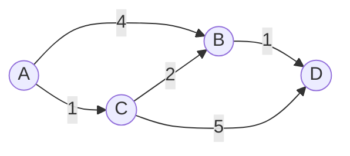

# Dijkstra's Algorithm

A greedy algorithm for finding the **shortest path** from a single source to all
other vertices in a weighted graph with non-negative edge weights. See also
[[Graph Theory]] and [[Priority Queue]].

> [!tip] Key idea
> Always expand the *closest* unvisited vertex. Once a vertex is visited its
> shortest distance is final — that is what makes the greedy choice correct.

## Complexity

With a binary-heap priority queue the running time is:

$$
O\big((V + E)\log V\big)
$$

where $V$ is the number of vertices and $E$ the number of edges. A Fibonacci
heap improves this to $O(E + V\log V)$.

<!-- colwidths:129,171 -->

| Priority queue | Time complexity  |
| -------------- | ---------------- |
| Array          | $O(V^2)$         |
| Binary heap    | $O((V+E)\log V)$ |
| Fibonacci heap | $O(E + V\log V)$ |

## How it works



Starting from `A`, vertices settle in order of increasing distance:
`A(0) → C(1) → B(3) → D(4)`.

## Reference implementation

```python
import heapq

def dijkstra(graph, source):
    dist = {v: float("inf") for v in graph}
    dist[source] = 0
    pq = [(0, source)]
    while pq:
        d, u = heapq.heappop(pq)
        if d > dist[u]:
            continue
        for v, w in graph[u].items():
            if d + w < dist[v]:
                dist[v] = d + w
                heapq.heappush(pq, (dist[v], v))
    return dist
```

## To review

- [x] Understand the greedy invariant
- [x] Implement with a binary heap
- [ ] Compare with [[Bellman-Ford]] for negative weights
- [ ] Solve three practice problems #todo

## Notes

Dijkstra does **not** work with negative edge weights[^neg]; use Bellman-Ford
instead. For unweighted graphs a plain breadth-first search suffices.

[^neg]: A negative edge can make an already-settled vertex reachable by a
    shorter path, violating the greedy invariant.
