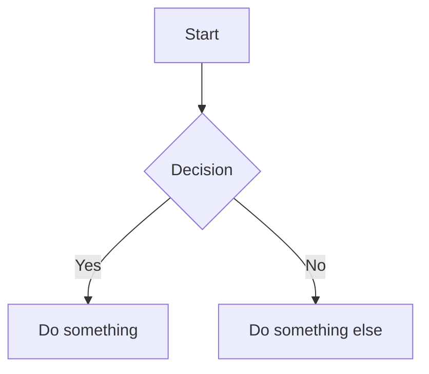

## Math (KaTeX)

Baram supports LaTeX math rendering powered by KaTeX.

**Block Math:**

1. Type `$$` and press Enter, or use `Cmd+Shift+M`
2. Write your LaTeX formula in the editing area
3. A live preview renders below as you type

```
$$
E = mc^2
$$
```

**Inline Math:**

Type `$formula$` to create an inline equation. When your cursor is inside the formula, you see the LaTeX source. Move away to see the rendered result.

## Code Blocks (CodeMirror 6)

Baram embeds a full CodeMirror 6 editor for each code block:

- **21 supported languages**: C, C++, CSS, Go, HTML, Java, JavaScript, JSON, Kotlin, LaTeX, Markdown, PHP, Python, Ruby, Rust, Shell, SQL, Swift, TypeScript, XML, YAML
- Language selection dropdown at the top of each block
- Syntax highlighting
- Languages are lazy-loaded for performance

To create a code block, type ` ``` ` followed by an optional language name and press Enter:

````
```python
def hello():
    print("Hello, Baram!")
```
````

## Mermaid Diagrams

Create diagrams using Mermaid.js syntax:

1. Type `/mermaid` or press `Cmd+Shift+D`
2. Write your Mermaid diagram code
3. A live preview renders below as you type

Supports all Mermaid diagram types: flowchart, sequence, class, state, entity-relationship, gantt, pie, mindmap, and more.

````

````
