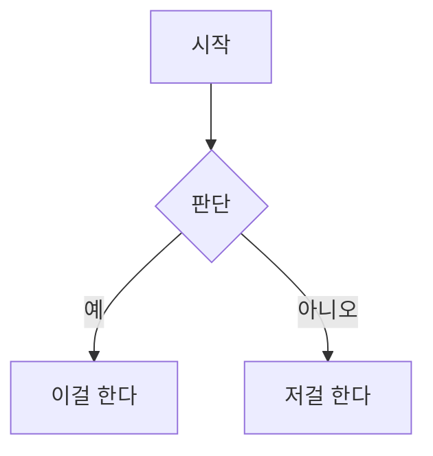

## 수식 (KaTeX)

Baram은 KaTeX로 LaTeX 수식을 렌더합니다.

**블록 수식:**

1. `$$`를 입력하고 Enter를 누르거나 `Cmd+Shift+M`을 씁니다
2. 편집 영역에 LaTeX 수식을 씁니다
3. 입력하는 동안 아래에 실시간 미리보기가 나타납니다

```
$$
E = mc^2
$$
```

**인라인 수식:**

`$수식$`을 입력하면 인라인 수식이 됩니다. 커서가 수식 안에 있으면 LaTeX 원본이 보이고, 벗어나면 렌더된 결과가 보입니다.

## 코드 블록 (CodeMirror 6)

Baram은 코드 블록마다 완전한 CodeMirror 6 에디터를 넣습니다.

- **지원 언어 21종**: C, C++, CSS, Go, HTML, Java, JavaScript, JSON, Kotlin, LaTeX, Markdown, PHP, Python, Ruby, Rust, Shell, SQL, Swift, TypeScript, XML, YAML
- 블록 위쪽에 언어 선택 드롭다운
- 구문 강조
- 언어는 성능을 위해 필요할 때 불러옵니다

코드 블록을 만들려면 ` ``` ` 뒤에 언어 이름을 (원하면) 적고 Enter를 누릅니다.

````
```python
def hello():
    print("Hello, Baram!")
```
````

## Mermaid 다이어그램

Mermaid.js 문법으로 다이어그램을 만듭니다.

1. `/mermaid`를 입력하거나 `Cmd+Shift+D`를 누릅니다
2. Mermaid 다이어그램 코드를 씁니다
3. 입력하는 동안 아래에 실시간 미리보기가 나타납니다

Mermaid의 모든 다이어그램 종류를 지원합니다 — flowchart, sequence, class, state, entity-relationship, gantt, pie, mindmap 등.

````

````
